**Level-up CSP Technical Training – Autonomous Agent Facilitator
Guide  **

Streamlining IT Support Operations with Autonomous Copilot Agent at
Contoso Solutions

Lab Guide for IT Support Desk Scenario

| Description | This lab is designed to help participants deploy an Autonomous Copilot Agent for Contoso Solutions’ IT support service desk. The Copilot Agent provides instant troubleshooting solutions for common IT issues, such as software glitches or hardware malfunctions, and automates ticket creation for unresolved problems. By leveraging Microsoft Copilot Studio and Dataverse, participants will simulate real-world IT support scenarios, configure the Copilot Agent to handle employee queries efficiently, and validate the end-to-end process of issue resolution and ticket management. This lab demonstrates how the solution improves IT support operations by reducing response times and automating repetitive tasks. |
|----|----|
| Prerequisites | Participants must have access to Admin Tenant Credential or Work/School ID, along with two personal email IDs for testing purposes. A Copilot Studio Viral Trial license and power apps trial license is required to configure the solution, along with a document outlining Contoso's common IT issues. Additionally, a support ticket Excel sheet must be available for tracking and managing ticket data during the lab. |
| Duration | 60 mins |
| Version | 1.0 |
| Publication date  | December 2024 |

This document is provided “as-is”. Information and views expressed in
this document, including URL and other Internet Web site references, may
change without notice. You bear the risk of using it. 

This document does not provide you with any legal rights to any
intellectual property in any Microsoft product. You may copy and use
this document for your internal reference purposes. 

 

© 2024 Microsoft. All rights reserved.  

## Objective

Deploy an Autonomous Copilot Agent for Contoso Solutions' IT support
service desk to provide immediate troubleshooting solutions to employees
and automate ticket creation for unresolved issues, improving response
times and reducing manual workload for the IT team.

## Solution Focus Area

Contoso Solutions, a software company, faces recurring challenges in
managing IT support requests from employees. Common issues like
non-functioning keyboards, internet connectivity problems, and software
glitches often require manual intervention, leading to delays in
resolution and decreased productivity.

Employees must currently wait for IT support staff to respond to their
queries or manually create tickets, which consumes valuable time.

To overcome these inefficiencies, Contoso Solutions aims to enhance its
IT support system by integrating a Copilot Autonomous Agent. This
solution will enable employees to quickly resolve common IT issues
through a chat interface and automate ticket creation for unresolved
problems, streamlining IT support operations.

## Solution

An Autonomous Copilot Agent will be implemented to transform IT support
at Contoso Solutions by:

- **Providing Real-Time Troubleshooting:** Assisting employees with
  instant solutions to common IT issues.

- **Automating Ticket Creation:** If the employee is unsatisfied with
  the suggested solutions, they can send an email summarizing the issue.
  The Agent will automatically create a support ticket in Dataverse,
  recording the issue details and notifying the IT support team for
  further action.

- **Storing and Tracking Data:** All interactions and ticket details
  will be stored in Dataverse for tracking, reporting, and continuous
  improvement of the support system.

## Personas

**Remy Morris – Software Developer**

Remy, a software developer at Contoso Solutions, experiences an issue
where their laptop restarts automatically without any warning. Remy
interacts with the Copilot Autonomous Agent in the IT Support chat
window, describing the problem.

The Copilot Agent suggests troubleshooting steps, such as checking for
recent software updates, verifying system settings, and running a
hardware diagnostics test. Remy follows the recommendations, and the
issue is resolved. Since the problem is fixed, Remy closes the chat
session without raising a support ticket.

**Mark Brown – Software Developer**

Mark, a software developer at Contoso Solutions, encounters an issue
where his monitor is not working and displays a "no signal" error. He
tries basic troubleshooting but is unable to resolve the problem on his
own.

Mark sends an email to the IT Support, describing the issue and
requesting support. The Copilot Agent automatically creates a support
ticket in Dataverse, capturing the details of Mark’s problem and
notifying the IT support team.

**David Flores – Support Engineer**

David, a Support Engineer, receives a notification about the support
ticket raised by Mark Brown. He reviews the details in Dataverse and
physically accesses Mark’s workstation to diagnose the issue. After
investigating, David identifies that the monitor's connection cable was
damaged.

David resolves the issue by replacing the cable and testing the monitor
to ensure it works properly. He updates the ticket with the resolution
details and marks it as resolved.

## Pre-Requisite 

1.  Admin tenant credential or Work / School Credentials

2.  Copilot Studio Viral Trial License

3.  Power Apps Trial License

4.  Two Personal Email ID

5.  Contoso Common IT Issue document

6.  Support Ticket excel sheet

#  Exercise 1: Creating the Contoso IT Support Agent

This exercise focuses on logging into Microsoft Copilot Studio and
creating a customized Copilot agent tailored for IT support operations
at Contoso. Participants will gain hands-on experience navigating
Copilot Studio, configuring environments, and building an AI-powered
agent to streamline IT workflows.

## Task 1: Logging into Microsoft Copilot Studio

1.  Navigate to copilot studio website
    <https://www.microsoft.com/en-us/microsoft-copilot/microsoft-copilot-studio>
    and click on the **Try free.**

2.  Enter admin tenant ID / work or school ID in the respected field and
    click on the **Next** button.

**Note:** For this lab we are using admin tenant credentials,
participant can use their work or school id to start free trial.

3.  Enter **Country or Region** and **Business phone number** in the
    respected fields. Select the check box and click on **Get started**
    button.

4.  In the confirmation section again click on the **Get Started**
    button.

##  Task 2: Creating and Configuring Contoso IT Support Agent 

1.  In copilot studio home section from top select the environment
    development environment**.** In our case its dev one participant
    chooses their environment.

2.  On welcome copilot studio tab, click on the **Skip** to move
    forward.

3.  From left navigation bar select **Create** and then select **New
    agent** to start creating new agent.

4.  From top right corner click on **Skip to configure** button.

5.  Enter **Name, Description and Instruction** of the agent as given
    below and click on **Create** button.

> **Name:** Contoso IT Support Agent
>
> **Description:** Create a Contoso IT Support Agent which transforms IT
> support at Contoso Solutions by providing instant troubleshooting for
> common issues, automating ticket creation for unresolved problems, and
> storing all interactions in Dataverse. This solution enhances response
> times, reduces manual workloads, and boosts employee productivity.
>
> **Instruction:** Create the Copilot Agent and configure it to handle
> IT support operations. Add a knowledge source containing solutions for
> common IT issues like hardware troubleshooting, connectivity, and
> software glitches. Set up a trigger to detect incoming emails from
> employees describing unresolved issues. Create an action to save these
> technical issues into a Dataverse table, ensuring all details are
> stored for tracking and reporting. Test the agent to validate its
> troubleshooting accuracy and ticket automation workflow before
> deployment.
>
> 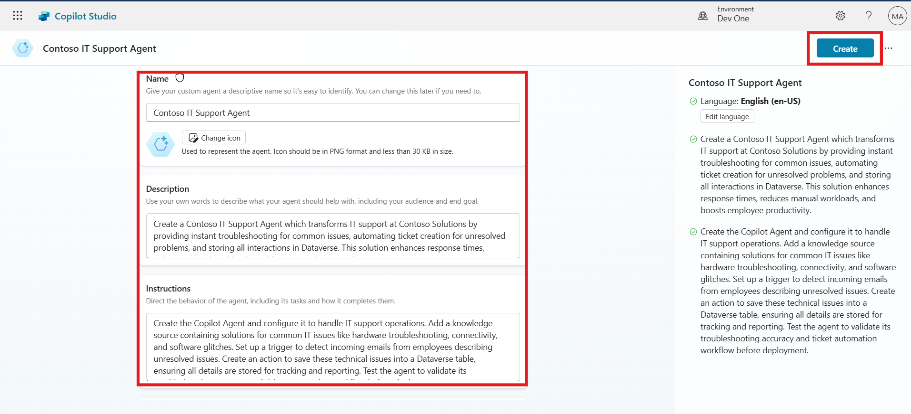 style="width:6.26806in;height:2.85694in" />

6.  On overview page of Contoso IT Support Agent, **Enable** the
    orchestrator for the agent.

7.  On overview page of the agent, **Disable** the “**Allow the AI to
    use its own general knowledge**” option.

8.  From top right corner of the agent, click on the **Settings**
    button.

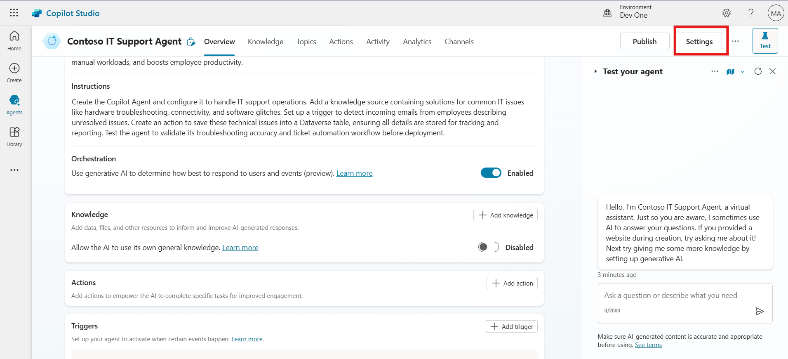

9.  Then go to Generative AI section, select the Generative AI
    (Preview), set content moderation as **Medium** and click on
    **Save** to save the setting.

##  Conclusion

By completing this exercise, participants will learn:

- How to access and set up Microsoft Copilot Studio.

- Steps to create and configure a custom Copilot agent.

- Practical skills in enabling generative AI and orchestrator settings
  for the agent.

- Ways to enhance IT operations by automating ticket creation and
  leveraging AI for troubleshooting.

# Exercise 2: Getting Started with Power Apps

This exercise introduces participants to Power Apps and Dataverse. The
goal is to log in to Power Apps, set up a working environment, and
create a Dataverse table by importing data from an Excel file.
Participants will learn essential skills for working with data-driven
applications.

## Task 1: Logging into Power Apps

1.  Navigate to power apps website
    <https://www.microsoft.com/en-us/power-platform/products/power-apps>
    and click on the **Try for Fre**e **button.**

>  style="width:6.26042in;height:2.82292in" />

2.  Enter admin tenant id / work or school id, check the box and click
    on **Start free,** for this tab we are using admin tenant id.

3.  Enter Country/ Region, Phone number, select box check box and click
    on the **Get started**.

>  style="width:6.26042in;height:3.04167in" />

4.  Confirm the account details and then click on the **Get started**.

>  style="width:6.26042in;height:3.07292in" />

5.  On the Stay signed in tab select **Yes**.

## Task 2: Setting Up a Dataverse Table

1.  On the power apps home page, from top select the development
    environment. In our case its Dev One, participant can choose their
    own environment.

2.  From the left navigation bar select **Tables.** In the tables
    section top bar click on the **+ New table** and then select
    **Create new tables**.

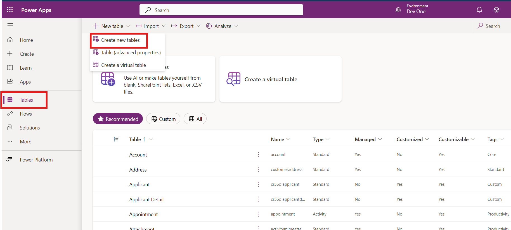

3.  Select **Import an Excel file or CSV** option to create a new table.

4.  Click on the select form device option and select **Support Ticket**
    excel file from **Lab Files** folder.

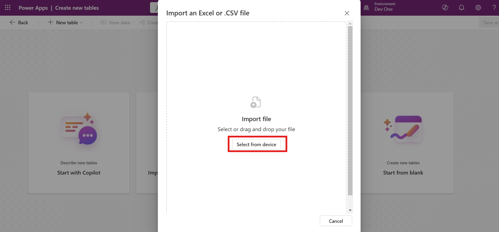

5.  Select the table and click on **View data** to see the table.

**Note:** In my case, the table is named *Employee Technical Support
Record*. The name may vary with each execution. Please save the table
name for future reference.

6.  Go to table data, select **Technical Issue Description down arrow**,
    select **Edit column**, Set the data type as **Text** ü°™ **Multiple
    line** ü°™ **Plain Text** and click on the **Update**. The column name
    may be different in each case.

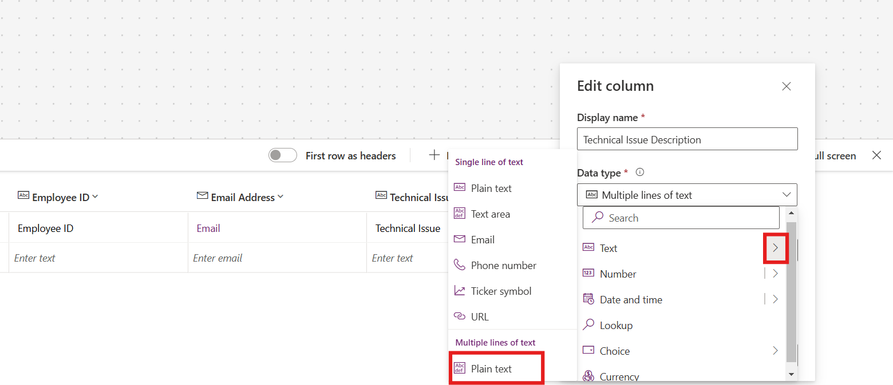

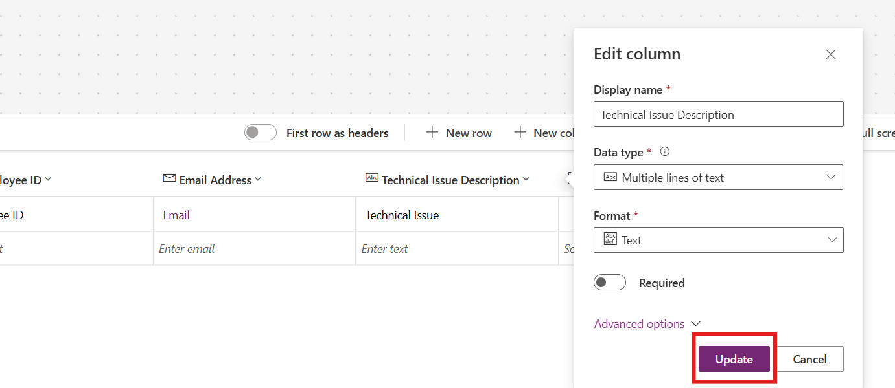

7.  Select **Current Status down arrow**, select **Edit column**, Set
    the Choices as **Unresolved, Resolved, Processing**. Set Default
    choices as **Unresolved** and click on the **Update**.

8.  From top right side click on **Save and exit** to save the table.

## Conclusion

By completing this exercise, participants will learn:

- How to access and navigate Power Apps using admin tenant / work or
  school credentials.

- Steps to create and configure a Dataverse table by importing data.

- Practical knowledge of setting up an environment to support app
  development workflows.

# Exercise 3: Enhancing Bot Capabilities

This exercise focuses on enhancing the capabilities of the Contoso IT
Support Agent by adding a knowledge base and customizing bot topics for
improved interaction. Participants will refine the bot's responses and
ensure it effectively assists users in troubleshooting and escalation.

## Task 1: Add Knowledge Base 

1.  On Contoso agent overview page, scroll down and click on **+ Add
    Knowledge** button.

2.  Select **Click to browse** button to add the lab file **Contoso IT
    Support Issue** from Lab Files folder and then click on **Add** to
    save the file.

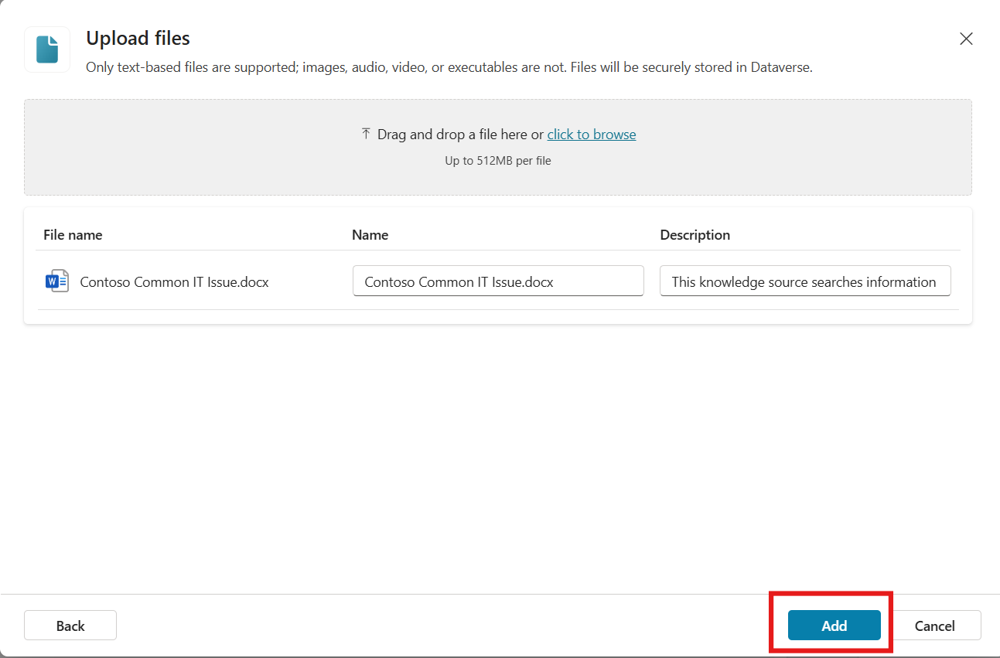

3.  Again, go to agent overview page, scroll down and click on **+ Add
    knowledge.**

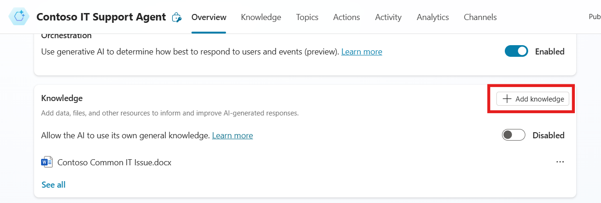

4.  Select **Dataverse (preview)** option as data source.

5.  In top right corner search bar, enter and search for **Employee**
    and select **Employee Technical Support Record** table. Then click
    on the **Next, Next** and **Add** button to add the knowledge
    source.

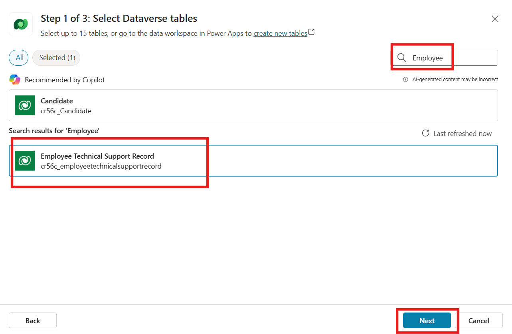

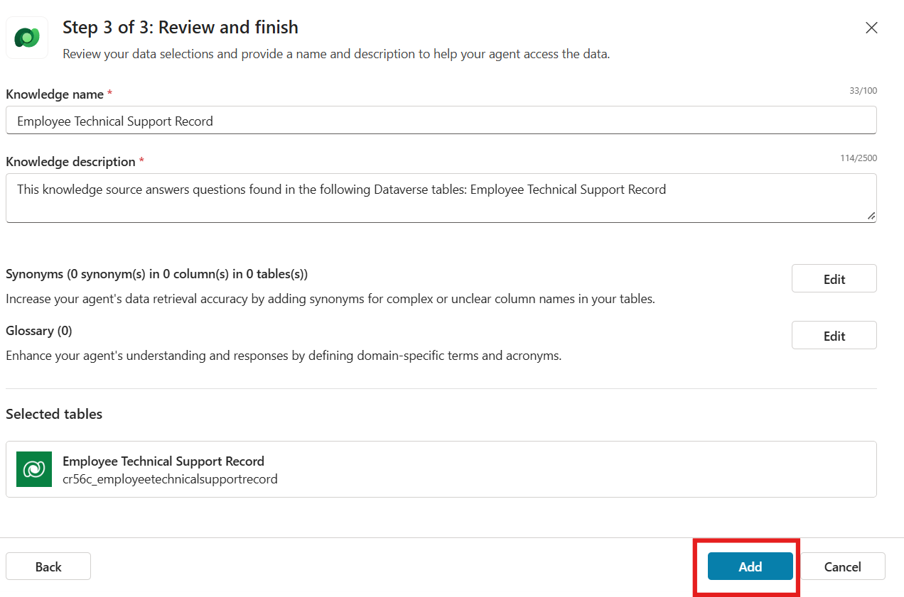

## Task 2: Customize the Conversation Start Topic

1.  From the top bar option click on **Topics** and then click and open
    **Conversation Start** topic.

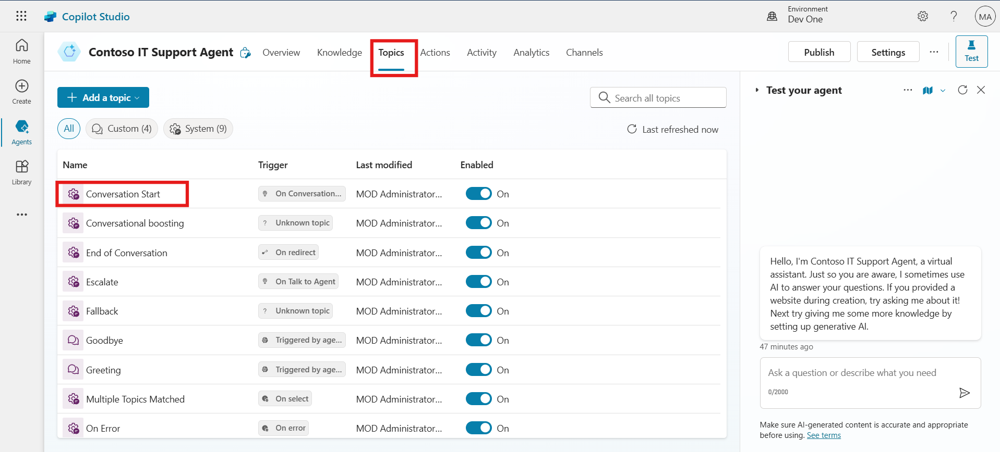

2.  Scroll down and go to message node. Update the message after bot
    name as given below:

Hello. I’m Bot Name, a virtual assistant. How can I help you?

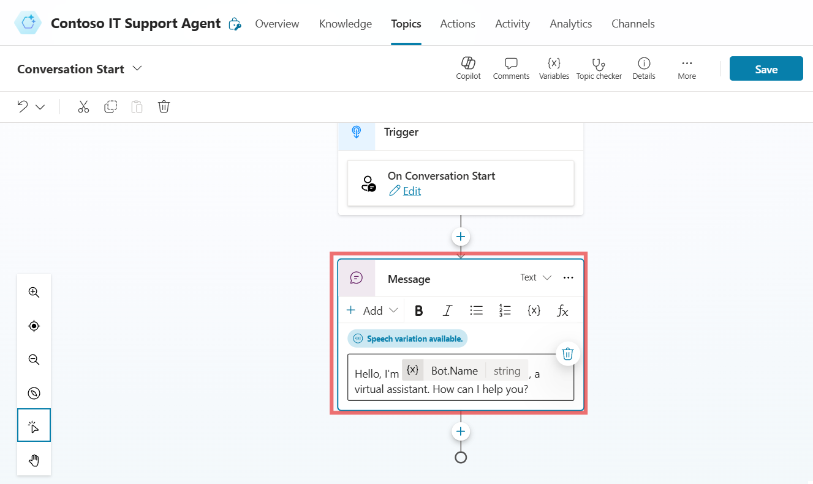

3.  From top click on the **Save** to save the topic.

##  Task 3: Update the Fallback Topic 

1.  From the top bar option click on **Topics** and then click and open
    **Fallback** topic.

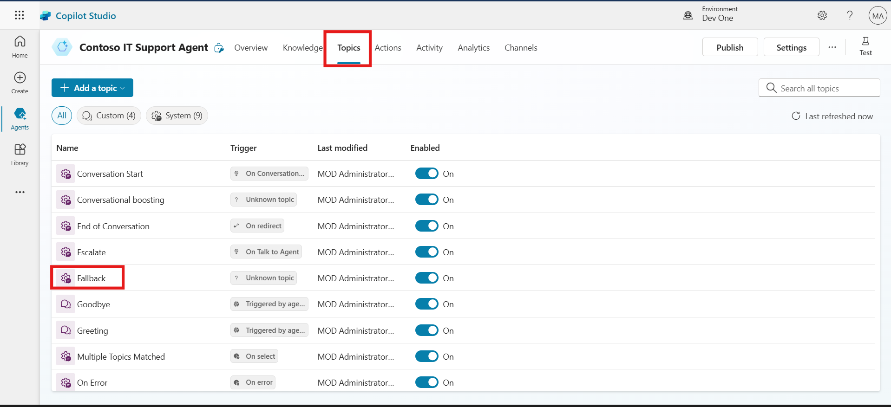

2.  Scroll down and go to message node. Update the message as given
    below:

I’m sorry. This information is not available in my system. You can raise
the support ticket via mail for this issue.

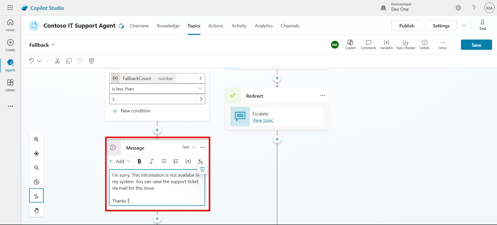

3.  From top right side click on the **Save** button to save the topic.

##  Conclusion

By completing this exercise, participants will learn:

- How to upload and integrate a knowledge base to enhance the bot's
  functionality.

- Steps to customize conversation start messages for a more engaging
  user experience.

- Techniques to update fallback responses for better handling of
  unsupported queries.

# Exercise 4: Test the agent

This exercise guides participants through testing the Contoso IT Support
Agent to validate its functionality. Participants will check how the bot
handles prompts using the knowledge base and fallback topics to ensure
seamless interaction and escalation.

1.  From top right corner click on the **Test** button. Then in test
    section click on **Map** turn it on and then click **Refresh**.

2.  Enter the prompt “**My printer is not working how to fix it.”.** It
    gives the solution as per knowledge source.

3.  Again, give the prompt **“Two factor Authentication (2FA) issue”.**

4.  The 2FA issue and solution is not available in the knowledge source
    so it will go to fallback topic and return prompt related to Raise
    Ticket.

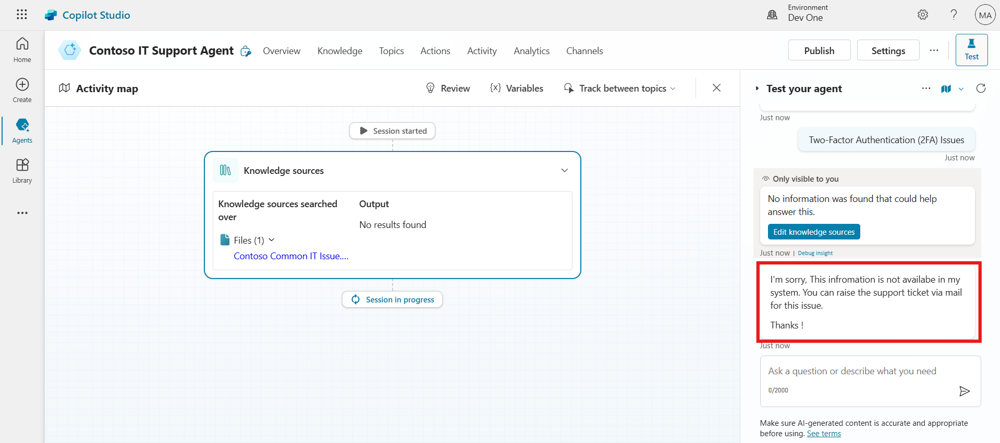

## Conclusion

By completing this exercise, participants will learn:

- How to test and activate an AI agent for troubleshooting.

- Validation of the bot’s ability to respond using its knowledge base.

- How fallback topics handle unsupported queries and redirect users
  effectively.

# Exercise 5: Automating Support Ticket Creation with Power Automate

This exercise demonstrates how to automate support ticket creation using
Power Automate and integrate it with the Contoso IT Support Agent.
Participants will create a flow to streamline issue reporting, record
data in Dataverse, and notify support engineers via email.

1.  Go to overview page of the agent, scroll down and click on the **+
    Add action**.

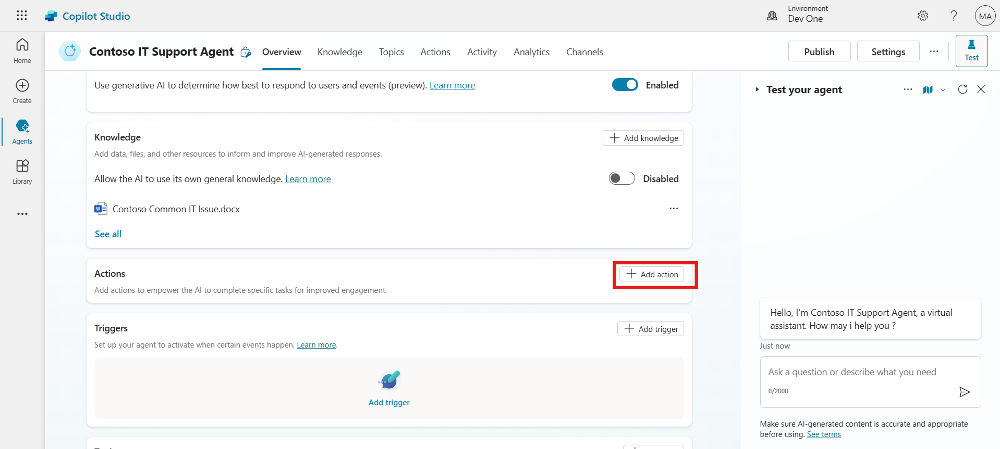

2.  In choose an action window, scroll down and click on **Create a new
    flow**, power automate flow window will open.

3.  In Power automate flow, click on **Run a flow from copilot** and
    then select **Add an Input**.

4.  Select **Text** as data type of input and rename the input as
    **Name**.

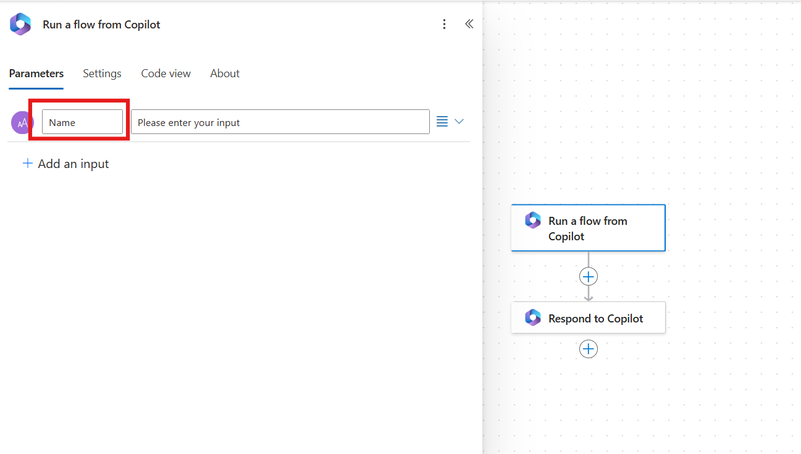

5.  With same procedure create more input as per given below details.

| **Input Name** | **Data Type** |
|----------------|---------------|
| ID             | Text          |
| Email          | Text          |
| Details        | Text          |

6.  Below Run a flow from copilot, click on **(+)** sign and select
    **Add an action**.

7.  In Add an action search bar, enter **Add a new row.** Then select
    **Add a new row** from Microsoft Dataverse section.

> Note: Sometimes Dataverse connection is not created automatically, so
> participant need to **sign** in with their credential, authentication
> should be **OAuth.**
>
>  style="width:6.26042in;height:3.07292in" />

8.  In **Table Name** section search and select **Employee Technical
    Support Record**.

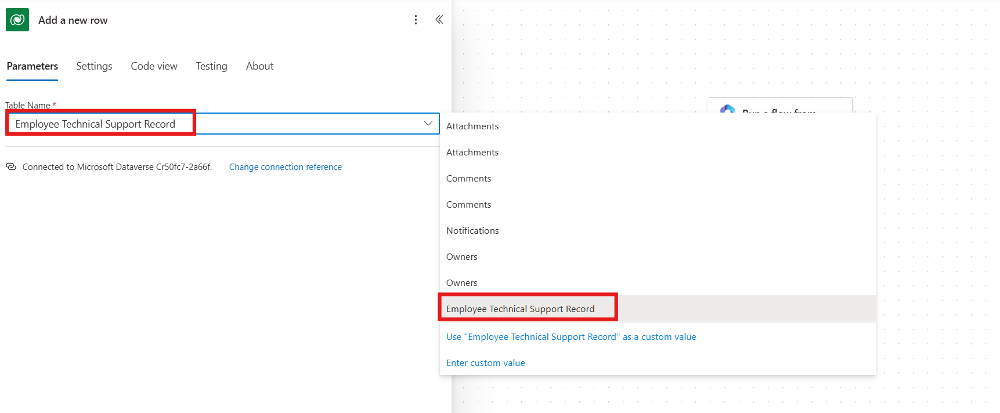

9.  Below table name select **Show all**, then click on the particular
    field and add input with the help of dynamic content button (Thunder
    bolt) as per the below given field. The **Current Status** field
    should be selected with drop down as **Unresolved**.

| Section                     | Input Variable          |
|-----------------------------|-------------------------|
| Employee Name               | Name (Dynamic Input)    |
| Email Address               | Email (Dynamic Input)   |
| Employee ID                 | ID (Dynamic Input)      |
| Technical Issue Description | Details (Dynamic Input) |

10. Below Add a new row action click on (+) and select **Add an
    action**.

11. In add an action section, enter **Send an email** in the search bar
    and select **send an email (V2)** from office 365 outlook section.

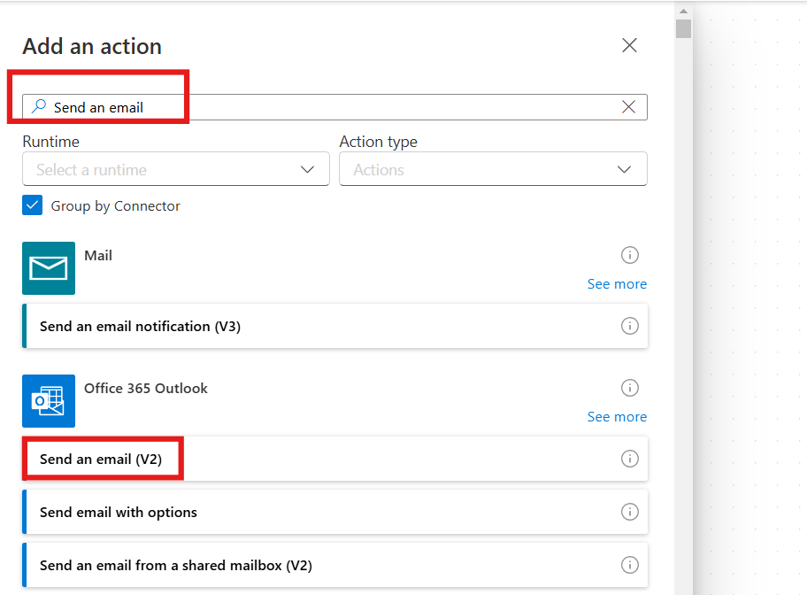

12. In send an email section, Enter the below given detail in the
    respected section:

<table>
<colgroup>
<col style="width: 13%" />
<col style="width: 86%" />
</colgroup>
<thead>
<tr>
<th>To</th>
<th>Enter support engineer email (Use any email id)</th>
</tr>
</thead>
<tbody>
<tr>
<td>Subject</td>
<td>New Technical Support Ticket Raised</td>
</tr>
<tr>
<td>Body</td>
<td>
A new technical support ticket has been raised and requires your
attention. Please find details below:

Employee Name: Name (Use Name dynamic content variable (Thunder
bolt))

Employee ID: ID (Use Name dynamic content variable (Thunder
bolt))

Technical Issue: Details (Use Name dynamic content variable (Thunder
Bolt))

Thank you for your prompt attention to this matter. 
 
Best Regards
</td>
</tr>
</tbody>
</table>

13. From top left corner rename the flow as **Employee Data.**

14. From top bar click on **Save draft** and then click **Publish**.

15. Go back to Copilot window and click on **Refresh** button.

16. In Choose an action window, select **Employee Data** flow.

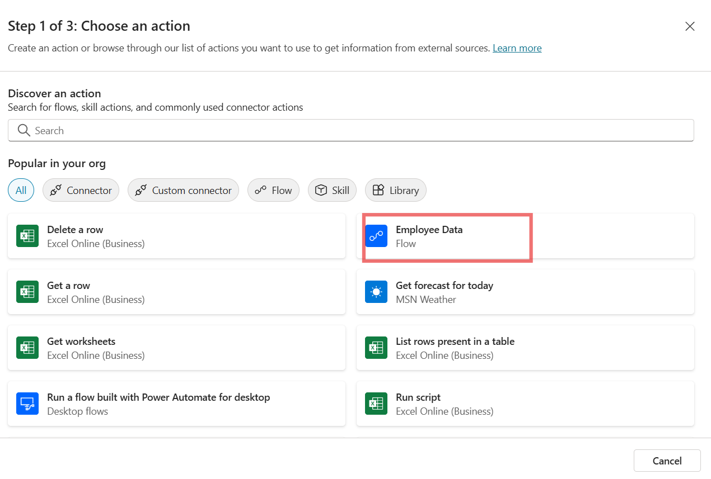

17. Click on **Next** to move forward and configure the flow.

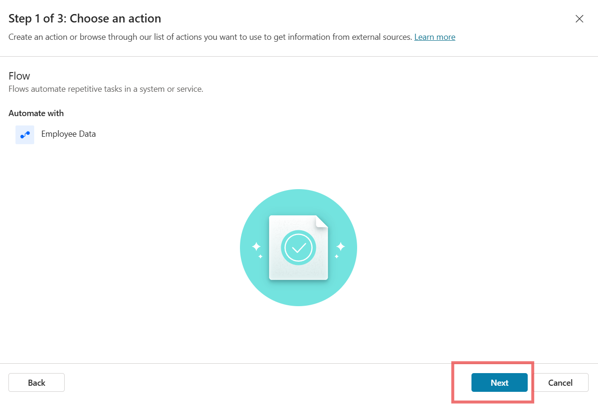

18. In the Review input and output window, click on **Edit inputs**.

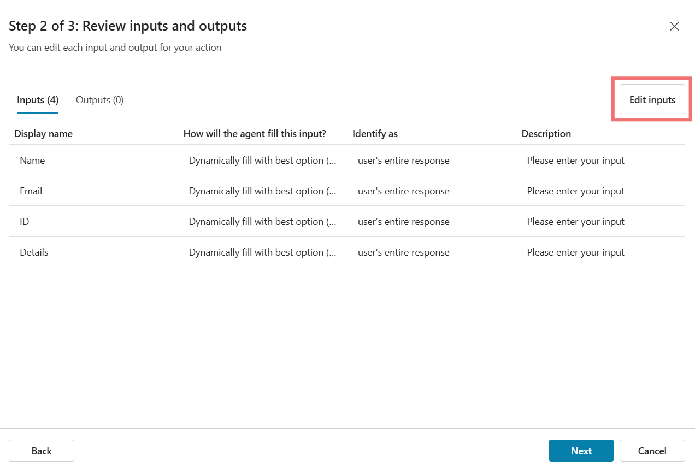

19. Enter the given description in the respected input, after entering
    the description click on **Save** button. After saving the inputs
    description click on **Next** and then **Finish**.

| Name -- Description | Enter the name of the employee. |
|----|----|
| ID -- Description | Enter the employee ID in the field. |
| Email -- Description | Enter the email address of the employee from whom the email is received. |
| Details -- Description | Enter the email details of the employee |

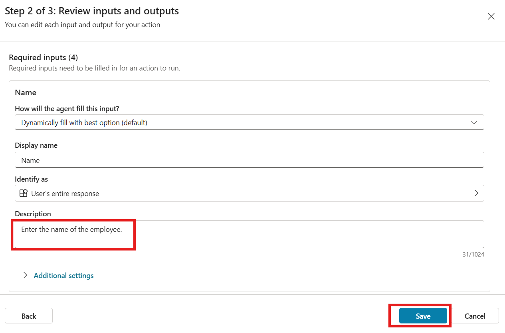

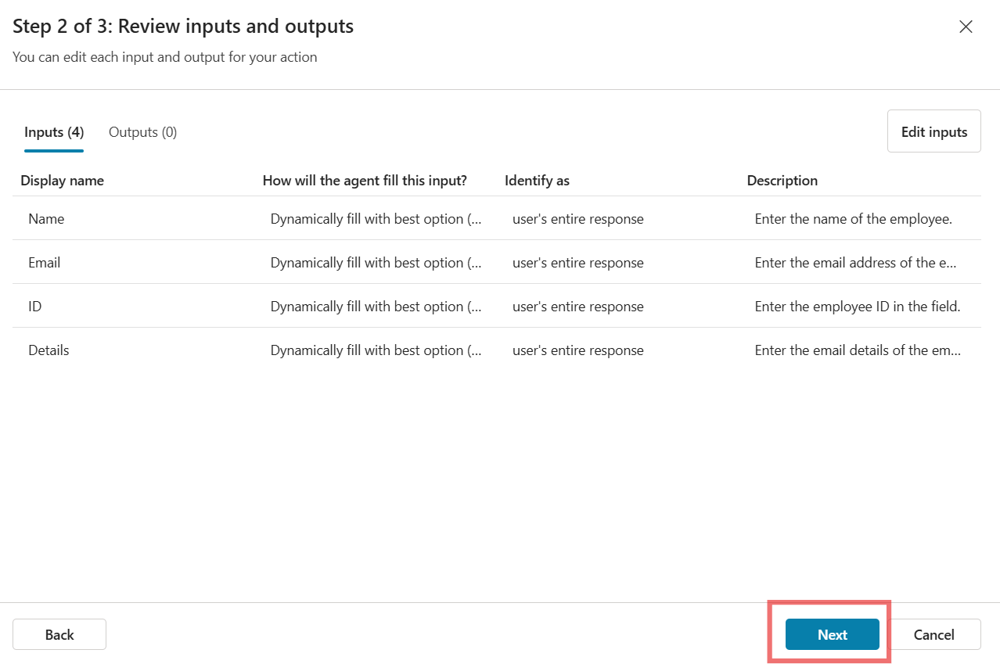

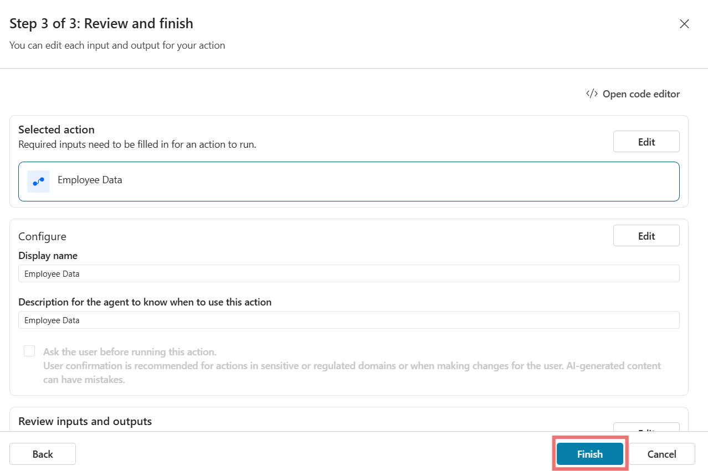

## Conclusion

By completing this exercise, participants will learn:

- How to integrate Power Automate flows with a Copilot agent for ticket
  creation.

- Steps to collect and map input data dynamically from user
  interactions.

- Techniques to automate email notifications for technical issue
  escalation.

- The ability to configure workflows for efficient support ticket
  management.

# Exercise 6: Configuring an Email-Based Trigger for Automated Actions

This continuation of automating support ticket creation focuses on
setting up a trigger in the Contoso IT Support Agent to link email
inputs with the automated Power Automate flow. Participants will
configure triggers and finalize the agent for deployment.

1.  Go to overview page of the agent, scroll down and click on **+ Add
    trigger**.

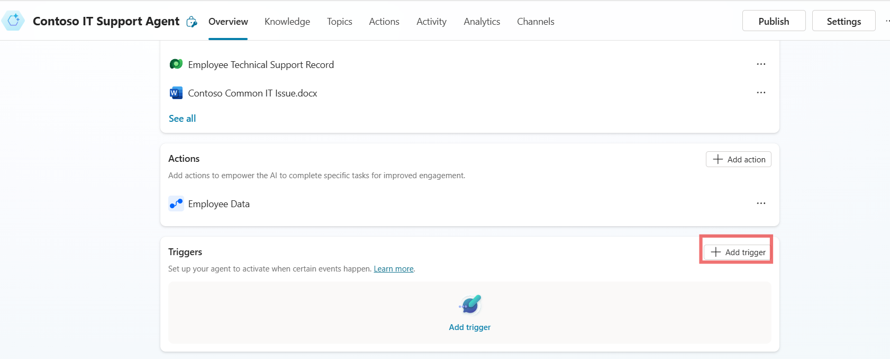

2.  Then from Add trigger window, select **When a new email arrives
    (V3)** trigger.

3.  After successful connection of copilot and outlook and green tick
    appears click on **Next** button.

4.  In folder field select folder icon and select **Inbox** folder and
    then select **Create trigger.**

5.  On Support agent overview page scroll down, on trigger section click
    on three dots **(…)** and select **Edit in Power Automate.**

6.  Right click on When a new email arrives trigger and select
    **Delete**.

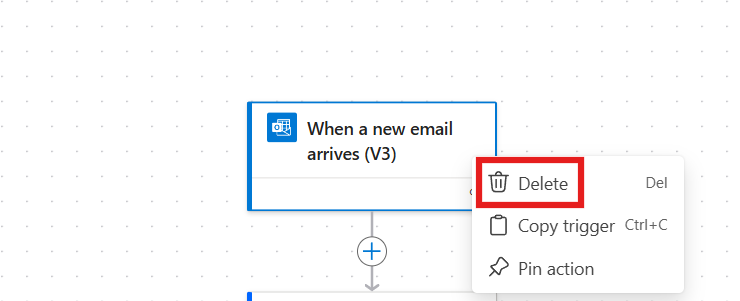

7.  Then click on Add a trigger, search for **When new email arrives**
    and select **When a new email arrives** trigger from **Office 365
    outlook** section.

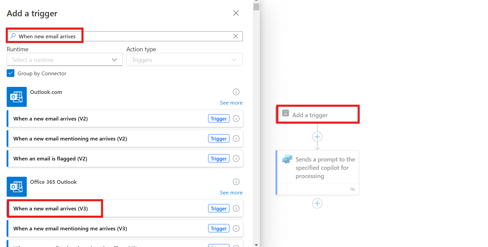

8.  Click on **Send a prompt to the specified copilot for processing**,
    in body/message section enter the prompt, **Run Employee Data flow
    and use content from Body From.** Replace “Body” and “From” as
    dynamic content variable (Thunder bolt option).

9.  **Save** and **Publish** the flow, close power automate window and
    go back to copilot window.

10. Go to overview section and from top right corner click on
    **Publish** and again click **Publish** to publish the copilot.

## Conclusion

By completing this exercise, participants will learn:

- How to set up triggers in Copilot to automate workflows based on email
  inputs.

- Steps to dynamically map email content to Power Automate flows.

- The process of publishing and finalizing the AI agent for operational
  use.

- Practical skills in linking communication tools like Outlook with
  automated workflows.

# Exercise 7: Test the agent

This exercise focuses on testing the integration of the Contoso IT
Support Agent with Power Automate and Outlook. Participants will verify
the agent's ability to process emails, create support tickets, and
trigger automated workflows effectively.

1.  Go to overview page of agent, scroll down, click on **(…)** on
    trigger and select **Edit in power automate**.

2.  It will navigate to power automate flow, from top bar click on
    **Test** button and then select **Manually** and again click on
    **Test**.

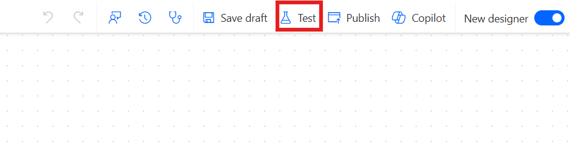

3.  Open outlook or other email service provider login and send email on
    same admin tenant or same school / work id which is using in copilot
    and power automate login.

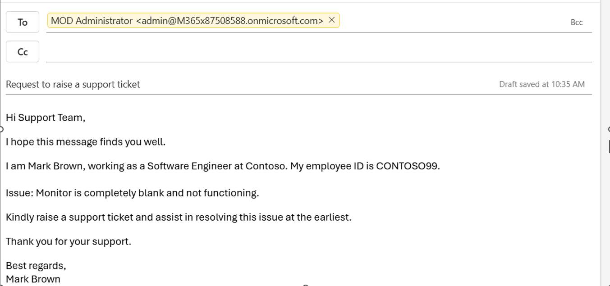

4.  Navigate to copilot agent overview page, scroll down and select
    **Test trigger**.

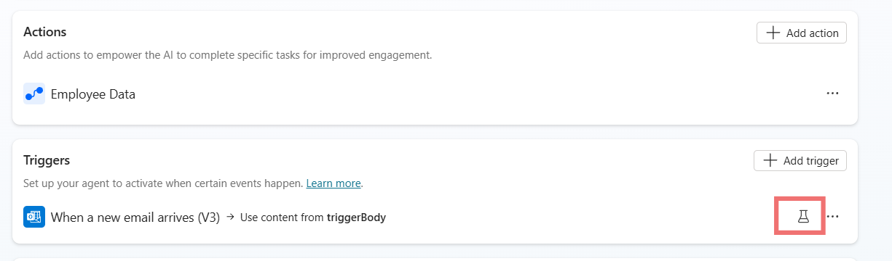

5.  Click on **Start testing**, it will start testing.

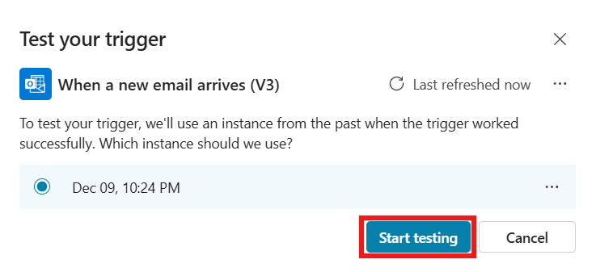

6.  In test section click on the **Connect**, it will open the
    connection window.

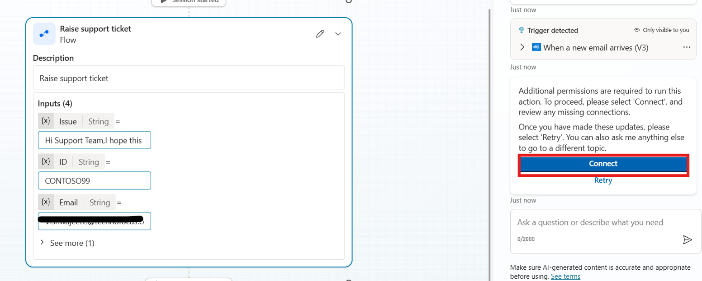

7.  Click on the **Connect** again and then select **Submit.**

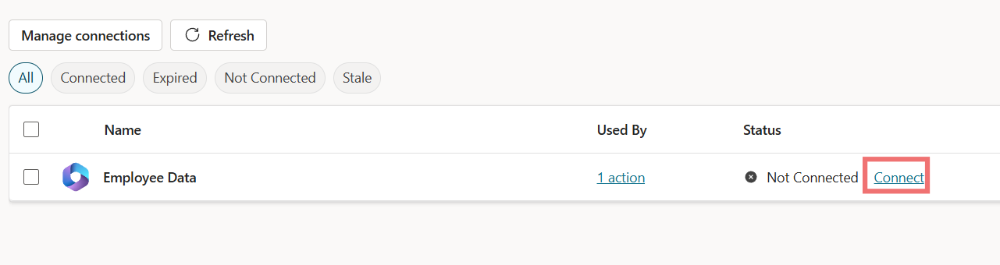

8.  Navigate to copilot studio window and re run the **Test**.

9.  The support request is automatically generated.

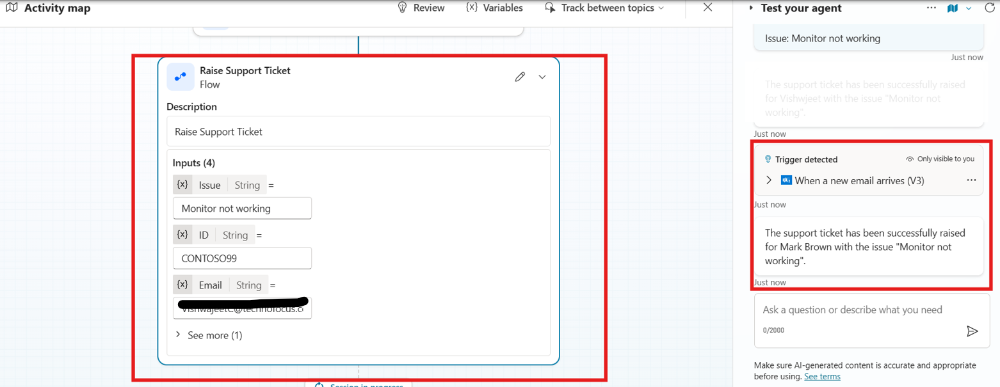

10. Navigate to power apps and go to Employee support ticket record
    table, and check the details.

11. Check the Support mail which we configure in power automate flow to
    send an email. The email is automatically sent to the support team.

12. Go to test window and writer query as user **“Mark Brown Ticket
    Current Status”**. It gives the status of the issue as unresolved.

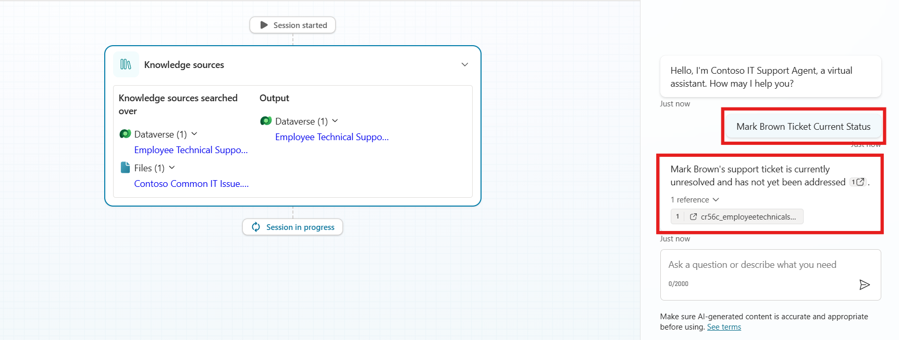

13. As Support Engineer, write a prompt in the test section. “**I want
    to know about all Unresolved ticket**”.

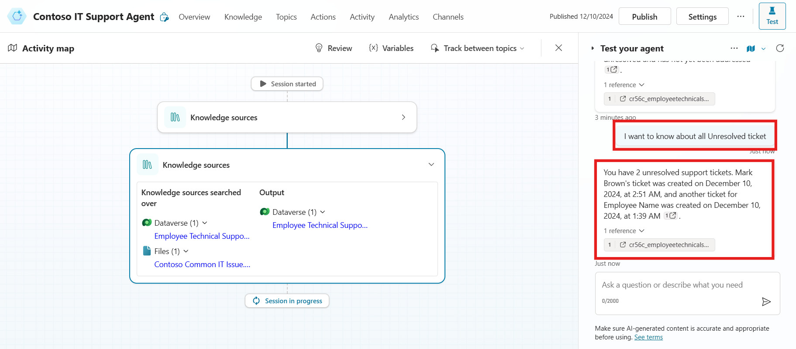

## Conclusion

By completing this exercise, participants will learn:

- How to test the agent's functionality by simulating real-world
  scenarios.

- Steps to validate email-triggered workflows and ticket generation in
  Power Automate.

- How to review generated records in Dataverse and ensure notifications
  are sent to the support team.

- Practical insights into debugging and finalizing automation workflows.

# Final Conclusion of the Lab Guide

This lab guide provided participants with a hands-on experience in
deploying an Autonomous Copilot Agent for Contoso Solutions' IT support
service desk. By following the step-by-step exercises, participants were
able to:

1.  **Set Up Copilot Studio**: Participants learned how to log into
    Copilot Studio, create and configure the IT support agent, and
    enable essential settings like generative AI and orchestrator for
    effective troubleshooting and ticket automation.

2.  **Navigate Power Apps**: Participants gained practical knowledge in
    logging into Power Apps, setting up a Dataverse table, and importing
    data from Excel to track and manage support tickets efficiently.

3.  **Enhance Bot Capabilities**: The exercises focused on adding a
    knowledge base to the bot, customizing the conversation start and
    fallback topics to improve user interaction, and ensuring the bot
    could handle a wide range of IT support scenarios.

4.  **Automate IT Support Tasks**: Participants also learned how to
    automate the creation of support tickets using Power Automate,
    enhancing the bot's capability to manage unresolved issues and
    improve IT team workflows.

By completing these exercises, participants were able to implement a
robust autonomous support system that improves response times, reduces
manual workload, and enhances overall productivity for IT support
operations. The integration of Copilot Studio, Power Apps, and Dataverse
ensures a seamless flow of information, automates routine tasks, and
optimizes support workflows, providing immediate troubleshooting
solutions to employees and automated ticket management for unresolved
issues.
