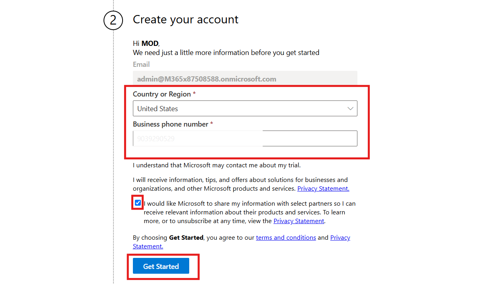
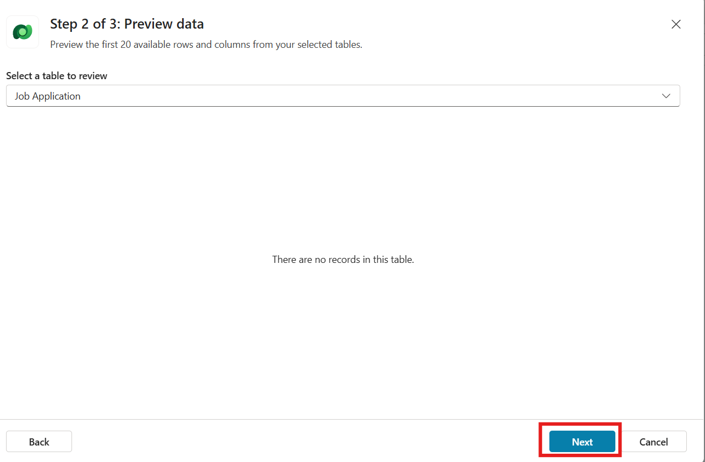
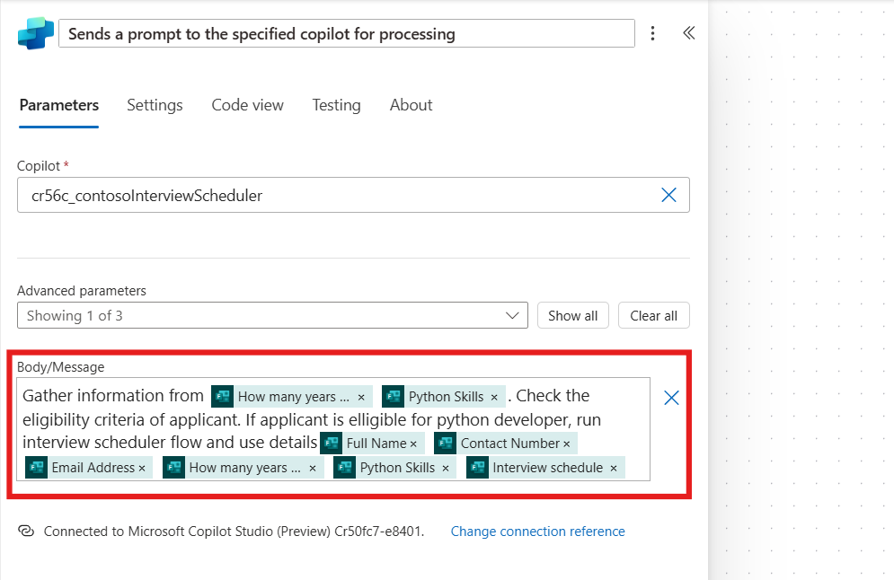

**Level-up CSP Technical Training – Autonomous Agent Facilitator
Guide  **

Designing a Smart Autonomous Agent for Recruitment Workflows

Lab Guide for Interview Scheduler Scenario

| Description | Contoso Solutions seeks to automate its HR recruitment process by implementing an Autonomous Copilot Agent. This solution will analyse candidate applications, compare them with job requirements, and shortlist qualified candidates. The agent will save shortlisted candidate details in Dataverse and automatically send interview invitations, including date, time, and location. By automating these tasks, the solution aims to reduce manual effort, minimize errors, and enable the HR team to focus on strategic initiatives. |
|----|----|
| Prerequisites | To implement this solution, the following are required: admin tenant credentials or a Work/School ID, Copilot Studio Trial License, Power Apps Trial License, a personal email ID, eligibility criteria for the Python Developer lab file, and an interview schedule lab file. |
| Duration | 60 mins |
| Version | 1.0 |
| Publication date  | December 2024 |

This document is provided “as-is”. Information and views expressed in
this document, including URL and other Internet Web site references, may
change without notice. You bear the risk of using it. 

This document does not provide you with any legal rights to any
intellectual property in any Microsoft product. You may copy and use
this document for your internal reference purposes. 

 

© 2024 Microsoft. All rights reserved.  

## Objective

Automate the HR recruiting process at Contoso Solutions by building an
Autonomous Copilot Agent that analyses candidate applications,
shortlists candidates based on job descriptions, saves their details
into Dataverse, and sends interview invitations to selected candidates.

## Solution Focus Area

At Contoso Solutions, the HR department faces the challenge of manually
sorting and processing large number of job applications. After sorting
the candidates, HR personnel manually send interview invitations, which
is time-consuming and prone to errors.

Address this, Contoso Solutions seeks to automate the entire process
from candidate analysis to interview scheduling. The Copilot Autonomous
Agent will analyse each application, shortlist candidates that meet job
requirements, save their details into Dataverse, and automatically send
interview invitations to the selected candidates. This will streamline
the process and significantly reduce HR's manual workload.

## Solution

The Copilot Autonomous Agent will automate key tasks in Contoso
Solutions' recruiting process:

- **Analysing Candidate Details:** The copilot automatically analyses
  application received by email, extracting relevant details.

- **Matching Job Requirements:** The copilot compares the extracted
  candidate details with job descriptions. If the candidate meets the
  qualifications, they are shortlisted.

- **Shortlisting and Data Entry:** Shortlisted candidates' details are
  saved into Dataverse, streamlining the data entry process for HR
  staff.

- **Sending Interview Invitations:** For selected candidates, the
  copilot automatically sends an email with interview details, including
  the date, time, and location, eliminating the need for HR to send
  these manually.

## Personas 

**Miriam Graham – The HR Manager's Automation Journey**

Miriam Graham, HR Manager at Contoso Solutions, faces the challenge of
managing hundreds of job applications for each opening. Manually
reviewing resumes, shortlisting candidates, recording details, and
sending interview invitations consumes significant time and often leads
to errors. To address this, Miriam decides to implement an Autonomous
Copilot Agent. This solution will analyse applications, match candidates
to job requirements, save shortlisted details into Dataverse, and send
automated interview invitations. With this, Miriam aims to streamline
recruitment, reduce manual effort, and focus on strategic HR tasks.

**Jane Miller – The Aspiring Python Developer**

Jane Miller, a skilled software developer, recently applied for the
Python Developer role at Contoso Solutions. Confident in her
qualifications and experience, she submits her application through the
portal. The Autonomous Copilot Agent will analyse her profile, match it
to the job requirements, and potentially invite her for an interview,
ensuring a swift and seamless recruitment experience.

## Pre-Requisite 

1.  Admin tenant credential or Work / School ID

2.  Copilot Studio Viral Trial License

3.  Power Apps Trial License

4.  One Personal Email ID

5.  Eligibility Criteria for Python Developer lab file

6.  Interview Schedule lab file

**  
**

# Exercise 1: Creating and configuring the Contoso Interview Scheduler Agent in Copilot Studio

In this exercise, you'll create and configure the Contoso Interview
Scheduler Agent in Microsoft Copilot Studio. You'll log in, set up the
agent to automate the hiring process, and configure it to analyse
applicants, schedule interviews, send notifications, and store data in
Dataverse. Additionally, you'll adjust settings for the agent's
generative AI features.

## Task 1: Logging into Microsoft Copilot Studio

1.  Navigate to copilot studio website
    <https://www.microsoft.com/en-us/microsoft-copilot/microsoft-copilot-studio>
    and click on the **Try free.**

2.  Enter admin tenant ID / work or school ID in the respected field and
    click on the **Next** button.

> **Note:** For this lab we are using admin tenant credentials,
> participant can use their work or school id to start free trial.

3.  Enter **Country or Region** and **Business phone number** in the
    respected fields. Select the check box and click on **Get started**
    button.

4.  In the confirmation section again click on the **Get Started**
    button.

## Task 2: Creating and Configuring Contoso Agent

1.  In copilot studio home section from top select the environment
    development environment**.** In our case its dev one participant
    chooses their environment.

2.  On welcome copilot studio tab, click on the **Skip** to move
    forward.

3.  From left navigation bar select **Create** and then select **New
    agent** to start creating new agent.

4.  From top right corner click on **Skip to configure** button.

5.  Enter **Name, Description and Instruction** of the agent as given
    below and click on **Create** button.

> **Name:** Contoso Interview Scheduler
>
> **Description:** The Contoso Interview Scheduler Agent automates
> hiring by analysing applicants' skills, filtering eligibility,
> scheduling interviews for qualified candidates, sending email
> notifications, and storing applicant data in Dataverse.
>
> **Instruction:** To create the Contoso Interview Scheduler Agent,
> start by setting up a Copilot agent and adding a form trigger to
> collect applicant information. Integrate a knowledge source with job
> descriptions for skill analysis. Next, build a Power Automate flow to
> schedule interviews for qualified applicants, send email notifications
> to the applicant, and store applicant details in a Dataverse table.
>
>  style="width:6.26806in;height:2.83889in" />

6.  On overview page of Agent, **Enable** the orchestrator for the
    agent.

7.  On overview page of the agent, **Disable** the “**Allow the AI to
    use its own general knowledge**” option.

8.  From top right corner of the agent, click on the **Settings**
    button.

9.  Then go to Generative AI section, select the Generative AI
    (Preview), set content moderation as **Medium** and click on
    **Save** to save the setting.

## Conclusion

By completing this exercise, participants will learn:

1.  Learned how to log into Microsoft Copilot Studio using admin or
    school/work ID.

2.  Created the "Contoso Interview Scheduler" agent to automate the
    hiring process.

3.  Configured the agent’s orchestrator and adjusted AI knowledge
    settings.

4.  Set up generative AI features with content moderation.

5.  Integrated Power Automate to schedule interviews and store applicant
    data in Dataverse.

# Exercise 2: Getting Started with Power Apps

In this exercise, you'll learn how to log into Power Apps and set up a
Dataverse table. First, you'll sign in to Power Apps and create an
account if necessary. Then, you'll create a new Dataverse table by
importing an Excel or CSV file, adjust the data types for specific
columns, and save the table for future use. This exercise introduces
basic Power Apps functionalities and prepares you for working with data
in the Power Platform.

## Task 1: Logging into Power Apps

1.  Navigate to power apps website
    <https://www.microsoft.com/en-us/power-platform/products/power-apps>
    and click on the **Try for Fre**e **button.**

>  style="width:6.26042in;height:2.82292in" />

2.  Enter admin tenant id / work or school id, check the box and click
    on **Start free,** for this tab we are using admin tenant id.

>  style="width:6.26042in;height:3.92708in" />

3.  Enter Country/ Region, Phone number, select box check box and click
    on the **Get started**.

>  style="width:6.26042in;height:3.04167in" />

4.  Confirm the account details and then click on the **Get started**.

>  style="width:6.26042in;height:3.07292in" />

5.  On the Stay signed in tab select **Yes**.

>  style="width:6.26042in;height:3.09375in" />

## Task 2: Setting Up a Dataverse Table

1.  On the power apps home page, from top select the development
    environment. In our case its Dev One, participant can choose their
    own environment.

2.  From the left navigation bar select **Tables.** In the tables
    section top bar click on the **+ New table** and then select
    **Create new tables**.

3.  Select **Import an Excel file or CSV** option to create a new table.

4.  Click on the select form device option and select **Interview
    Schedule** excel file from **Lab Files** folder.

5.  Select the table and click on **View data** to see the table.

**Note:** In my case, the table is named *Job Application*. The name may
vary with each execution. Please save the table name for future
reference.

6.  Select first row of the table and click on the **Delete rows**.

7.  Go to table data, select **Skill Set down arrow**, select **Edit
    column**, Set the data type as **Text** 🡪 **Multiple line** 🡪
    **Plain Text** and click on the **Update**.

8.  Select **Interview Schedule down arrow**, select **Edit column**,
    Set the data type as **Single line of text** and click on the
    **Update**.

9.  From top right side click on **Save and exit** to save the table.

## Conclusion

By completing this exercise, participants will learn:

1.  Logged into Power Apps using admin or work/school ID, and created an
    account if necessary.

2.  Selected the Dev environment in Power Apps.

3.  Created a new Dataverse table by importing an Excel or CSV file.

4.  Viewed and managed table data, including deleting rows.

5.  Edited columns to adjust data types for specific fields (e.g., Skill
    Set and Interview Schedule).

6.  Saved the newly created Dataverse table for future use.

# Exercise 3: Configuring Agent Knowledge Sources and Conversation Topics

In this exercise, you'll learn how to enhance your agent by adding
knowledge sources and customizing conversation topics. First, you'll add
knowledge sources, including a document file and a Dataverse table, to
your agent. Then, you'll customize the conversation start topic by
modifying the default message to improve user interaction. This exercise
will help you personalize the agent’s responses and integrate relevant
data for a more efficient experience.

## Task 1: Adding Knowledge Sources to the Agent

1.  Navigate to overview section of the agent, scroll down and click on
    the **+ Add knowledge.**

2.  Click on the **Click to browse** button and select the lab file
    **Eligibility criteria for python developer** doc file. After
    selection of file click on the **Add** button to add the file.

3.  Again, go to overview section of the agent, scroll down and click on
    **+ Add knowledge** button.

4.  From Add knowledge window select **Dataverse** as the source.

5.  From the top right corner search bar search for **Job Application**,
    select **Job application** Dataverse table and click on the **Next**
    Button.

6.  Click on **Next** and the select **Add** to add the Dataverse table
    in the agent as knowledge source.

## Task 2: Customizing the Conversation Start Topic 

1.  Navigate to overview section of the agent, select **Topics** from
    top bar and then select **Conversation Start** topic.

2.  Scroll down the conversation start topic, go to Message node, after
    “virtual assistant” word remove remaining message and add **“How may
    I help you?**” message.

3.  From top right corner click on the **Save** button to save the
    topic.

## Conclusion

By completing this exercise, participants will learn:

1.  Added knowledge sources to the agent, including a document file and
    a Dataverse table (Job Application).

2.  Customized the conversation start topic by modifying the default
    message to improve user interaction (replacing it with "How may I
    help you?").

3.  Saved the customized conversation topic to enhance the agent's
    responses.

# Exercise 4: Test the agent

1.  Navigate to overview section of the agent and from top right corner
    click on the Test to start testing.

2.  Enter the prompt **“What is eligibility criteria?”** in the section
    and then submit it. It will return given below output.

3.  Enter the prompt **“Is SQL Database is required for the python
    developer position ?”** in the section and then submit it. It will
    return given below output.

# Exercise 5: Creating an Interview Scheduler Flow and Integrating It with Copilot

In this exercise, you'll create a Power Automate flow to schedule
interviews and integrate it with your Copilot agent. You'll set up a
series of inputs, such as name, email, and experience, to collect
applicant information. Then, you'll configure actions to add the data to
a Dataverse table, send an interview invitation email, and save and
publish the flow. Finally, you'll integrate the flow into your Copilot
agent, enabling it to automate the interview scheduling process.

1.  Navigate to overview section of the agent, scroll down and click on
    **+ Add Action.**

2.  Scroll down and click on the **Create a new flow** to create new
    power automate flow.

3.  Select **Run a flow from copilot** and click on the **Add an
    input.**

4.  Select **Text** as input type and then rename the input as **Name**.

5.  With same process make five more input as given below:

| Input Name | Data Type |
|------------|-----------|
| Email      | Text      |
| Phone      | Text      |
| Skill      | Text      |
| Schedule   | Text      |
| Experience | Number    |

6.  Below Run a flow from copilot Click on the **+** Sign and select
    **Add an action.**

7.  In **Add an action** window search for **Add a new row** and select
    **Add a new row** action from Dataverse section.

> Note: Some time Dataverse connection is not created automatically, so
> participant need to **sign** in with their credential, authentication
> should be **OAuth.**
>
>  style="width:6.26042in;height:3.07292in" />

8.  In the table name section search and select **Job Application**
    table.

9.  Below table name click on **Show all** and click on the particular
    field and add the parameter with the help of dynamic content button
    **(Thunder bolt)** in the field as given below:

| Field              | Input                              |
|--------------------|------------------------------------|
| Applicant Name     | Name (Dynamic Content Input)       |
| Contact Number     | Phone (Dynamic Content Input)      |
| Email Address      | Email (Dynamic Content Input)      |
| Interview Schedule | Schedule (Dynamic Content Input)   |
| Skill Set          | Skill (Dynamic Content Input)      |
| Year of Experience | Experience (Dynamic Content Input) |

10. Below Add a new row action click on the **+** Sign and select **Add
    an action.**

11. In add an action section search and select **Send an email** from
    office 365 outlook section.

12. In send an email action from top click on the **Switch to advanced**
    option.

13. Enter the given below content in the respected fields:

<table>
<colgroup>
<col style="width: 13%" />
<col style="width: 86%" />
</colgroup>
<thead>
<tr>
<th>To</th>
<th>Select Email dynamic content input variable</th>
</tr>
</thead>
<tbody>
<tr>
<td>Subject</td>
<td>Congratulations! You’re Selected for a Python Developer
Interview</td>
</tr>
<tr>
<td>Body</td>
<td>
Dear Name (Select Name dynamic content input variable (Thunder
bolt option)),

Congratulations! We are excited to inform you that you have been
selected to move forward in the interview process for the Python
Developer role at Contoso. Your skills and experience align well with
the requirements of this position, and we look forward to learning more
about you.

Interview Details:

Date: Schedule (Select Schedule dynamic content input variable
(Thunder bolt option)))

Location: 1234 Contoso Avenue, Seattle, WA 98101, United States

If you have any questions, feel free to reach out. We look forward to
speaking with you! Best regards,

Contoso HR Team
</td>
</tr>
</tbody>
</table>

14. From the top left corner rename the flow as **Interview Scheduler**.

15. From the top bar **Save** and **Publish** the flow.

16. Go back to copilot studio window and click on the **Refresh**
    button.

17. Select the **Interview** **Scheduler** flow and then click on the
    **Next** button.

18. From the top right corner of the Review input and output window,
    click on the **Edit Inputs** button.

19. Enter the description in the respected section as given below, after
    entering the description click on the **Save** button.

| Name       | Enter the name of the applicant.               |
|------------|------------------------------------------------|
| Email      | Enter the Email of the applicant.              |
| Phone      | Enter the contact number of the applicant.     |
| Skill      | Enter the skills of the applicant.             |
| Schedule   | Enter the interview schedule of the applicant. |
| Experience | Enter the experience of the applicant.         |

20. Then click on the **Next** and then **Finish** button to add the
    action in the agent.

## Conclusion

By completing this exercise, participants will learn:

1.  Created a Power Automate flow to schedule interviews, collecting
    applicant information such as name, email, phone, skill, schedule,
    and experience.

2.  Configured actions to add applicant data to a Dataverse table (Job
    Application) and send an email invitation to the applicant.

3.  Published the flow and integrated it with the Copilot agent for
    automating the interview scheduling process.

4.  Customized the input fields and provided descriptions for each input
    in the agent.

# Exercise 6: Creating Python Developer Application Form in Microsoft Forms

In this exercise, you'll create a Python Developer Application Form
using Microsoft Forms. You'll sign in to Microsoft Forms, create a new
form titled "Python Developer Application Form," and add required fields
such as name, contact number, email, experience, skills, and interview
schedule. Once the form is created, you'll collect responses by
generating a URL and testing the form to ensure it works as expected.
This exercise helps you build a structured form to gather applicant
information efficiently.

1.  Navigate to Microsoft forms website
    <https://www.microsoft.com/en-gb/microsoft-365/online-surveys-polls-quizzes>
    and click on the **Sign in** button.

2.  Enter the admin tenant id / work or school id on the field and click
    on the **Next** button.

3.  Enter the password in the respected field and then click on the
    **Sign in** button.

4.  Select **Yes** to stay signed in Microsoft forms.

5.  From top left click on the **New Form** to start creating new form.

6.  Add the heading "**Python Developer Application Form**" to the form
    and create the following fields with their respective types. Turn on
    **Required** for all fields.

<table>
<colgroup>
<col style="width: 50%" />
<col style="width: 49%" />
</colgroup>
<thead>
<tr>
<th style="text-align: center;">Field Name</th>
<th style="text-align: center;">Type</th>
</tr>
</thead>
<tbody>
<tr>
<td>Full Name</td>
<td>Text</td>
</tr>
<tr>
<td>Contact Number</td>
<td>Text</td>
</tr>
<tr>
<td>Email Address</td>
<td>Text</td>
</tr>
<tr>
<td>How many years of Python development experience do you have?</td>
<td>Text</td>
</tr>
<tr>
<td>Python Skills</td>
<td>Text</td>
</tr>
<tr>
<td>Interview Schedule</td>
<td>
Choice

<ol type="1">
<li>
16/12/2024 Monday
</li>
<li>
18/12/2024 Wednesday
</li>
<li>
20/12/2024 Friday
</li>
</ol></td>
</tr>
</tbody>
</table>

7.  From top click on the **Collect responses** button and **Copy** the
    URL.

8.  Open new window tab and paste the URL and open the form.

## Conclusion

By completing this exercise, participants will learn:

1.  Created a "Python Developer Application Form" using Microsoft Forms
    with fields for full name, contact number, email, experience,
    skills, and interview schedule.

2.  Set all fields as required for applicant information collection.

3.  Generated a URL to collect responses and tested the form to ensure
    it works as expected.

# Exercise 7: Automating Applicant Eligibility and Interview Scheduling Using Copilot and Power Automate

In this exercise, you'll automate the process of checking applicant
eligibility and scheduling interviews using Copilot and Power Automate.
You'll set up a trigger for when a new response is submitted to the
"Python Developer Application Form," process the responses, and check
the applicant's eligibility based on their skills and experience. If
eligible, the Interview Scheduler flow will be triggered with the
applicant's details. Finally, you will test the flow to ensure the
automation is working correctly, ensuring smooth integration of
applicant data and scheduling processes.

1.  Navigate back to copilot studio overview page window, scroll down
    and click on **+ Add trigger** button.

2.  From top right corner search for **Form** and select **When a new
    response is submitted** trigger and then click on the **Next**
    button.

3.  In the Form Id field select **Python Developer Application form**
    and then click on the **Create trigger**.

4.  Navigate to agent overview page, scroll down, click on the three
    dots **(…)** on **When a new response is submitted** trigger, select
    **Edit in Power Automate button** to start editing.

5.  Right click on **When a new response is submitted** trigger and
    select **Delete** to remove the trigger.

6.  Click on Add a trigger in the canvas, on add a trigger window search
    and select **When a new response is submitted** trigger from
    Microsoft Forms.

7.  In Form Id field, select **Python Developer Application Form.**

8.  Below When a new response is submitted trigger, click on the **+**
    sign and select **Add an action** button.

9.  Search and select **Get response details** action from Microsoft
    Forms section.

10. In Form Id field select **Python Developer Application** Form and in
    Response Id field select **Response Id** dynamic variable (Thunder
    bolt option)).

11. Select Send a prompt to the specified copilot for processing action
    and enter the below given message in the body/message field.

Note: There is multiple dynamic content variables are selected in the
message please replace the message content with the help of dynamic
content thunder bolt option.

Gather information from **Python Skills (Variable)** and **How many
years of Python development experience do you have? (Variable)**. Check
the eligibility criteria of applicant. If applicant is eligible for
python developer, run interview scheduler flow and use details **Full
Name (Variable), Contact Number (Variable), Email Address (Variable),
How many years of Python development experience do you have? (Variable),
Python Skill (Variable), Interview Schedule (Variable).**

12. From top bar click on **Save** and then **Publish** to publish the
    flow.

13. Next to Save draft button click on the **Test** to test the flow.

14. Select the **Manually** option and then click on the **Test.**

15. Navigate to Form URL window and enter the following details in the
    form, then click on the **Submit**.

| Full Name | Jane Miller |
|----|----|
| Contact Number | 9874565478 |
| Email Address | Your email address |
| How many years of Python development experience do you have? | 5 |
| Python Skills | Experience in Django, Flask, SQL, No SQL, Azure, Kubernetes |
| Interview Schedule | Select (16/12/2024 Monday) |

16. After submitting the form, navigate to flow test window, test flow
    will be completed.

19. Go to overview section and from top right corner click on
    **Publish** and again click **Publish** to publish the copilot.

## Conclusion

By completing this exercise, participants will learn:

1.  Setting up triggers in Copilot Studio to initiate workflows based on
    form submissions.

2.  Using Power Automate to process form responses and check applicant
    eligibility based on specific criteria (skills and experience).

3.  Integrating Copilot with Power Automate to trigger additional
    actions, such as interview scheduling, based on eligibility.

4.  Testing and publishing automated flows to streamline applicant
    management and interview scheduling processes.

# Exercise 8: Test the agent

In this exercise, you will test the functionality of the agent to ensure
that it correctly processes applicant information and triggers actions
like shortlisting candidates for an interview. You will connect the
agent, initiate a test, check the Job Application table for applicant
details, and verify that an email is sent to the shortlisted candidate.
Additionally, you will test the agent's response to a prompt from the HR
Manager, ensuring the agent returns the correct details of the selected
candidate and interview schedule.

1.  Navigate to agent overview page, scroll down and click on the
    **Test** button on trigger and then select **Start testing**.

2.  On the test section, Permission required prompted, click on the
    **Connect** Button.

3.  On the connection window click on the connect and then click on the
    **Submit**.

4.  After successfully connected, navigate back to agent overview page
    scroll down, click on the **Test** button and the click **Start
    testing**.

5.  The application successfully executed and applicant is short listed
    for the interview.

6.  Navigate to Power app Job Application table and check the applicant
    details in the table.

7.  After shortlisting the candidate, an email sends to the applicant.

8.  In the test window, HR Manager enter the prompt **“show me selected
    candidate detail and interview schedule “**. It returns the detail
    of the applicants.

## Conclusion 

By completing this exercise, participants will learn:

1.  Test the agent’s functionality by connecting and initiating the
    test.

2.  Ensure the agent processes and shortlists applicants correctly.

3.  Verify that applicant details are added to the Job Application
    table.

4.  Confirm the shortlisted candidate receives an interview email.

5.  Test the agent’s response to prompts, such as retrieving selected
    candidate details.

# Final Conclusion of the Lab Guide

This lab guide provided participants with a hands-on experience in
deploying Smart Autonomous Agent for Recruitment Workflows for Contoso
solutions. By following the step-by-step exercises, participants were
able to:

1.  **Created a Power Automate Flow** to automate the interview
    scheduling process by collecting applicant information (name, email,
    phone, skill, schedule, and experience) through inputs in Copilot.

2.  **Integrated the Flow with Copilot**, enabling automatic interview
    scheduling and applicant data storage in the Dataverse Job
    Application table.

3.  **Configured Email Notifications**, ensuring applicants receive
    interview invitations once their details are added to the system.

4.  **Created a Python Developer Application Form** using Microsoft
    Forms to collect necessary details from applicants.

5.  **Automated Applicant Eligibility Checks**, processing responses
    from the Microsoft Form to determine eligibility based on skills and
    experience, then triggering the interview scheduler flow for
    eligible applicants.

6.  **Tested the Entire Workflow**, ensuring that form submissions,
    eligibility checks, and interview invitations were triggered as
    expected.

7.  **Validated Data** by reviewing the Job Application table in Power
    Apps and confirming that emails were sent to shortlisted candidates.

8.  **Ensured Successful Agent Performance**, testing the agent's
    functionality by processing form data, interacting with Copilot, and
    retrieving candidate details based on prompts.

This lab demonstrated the power of integrating Copilot with Power
Automate and Microsoft Forms to streamline applicant management and
interview scheduling, creating an automated and efficient HR process.
