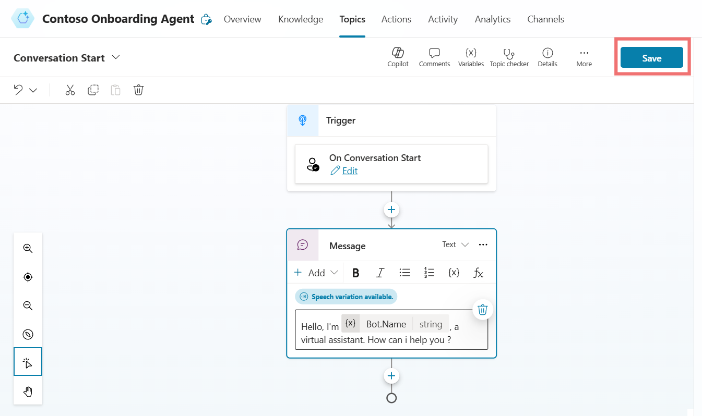
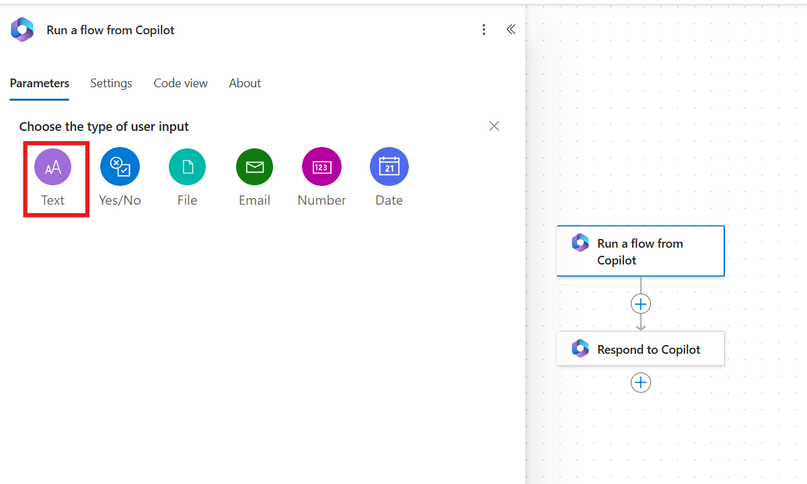
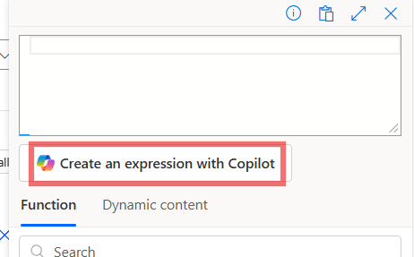
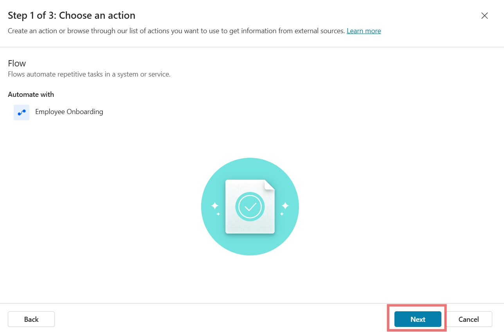

**Level-up CSP Technical Training – Autonomous Agent Facilitator
Guide  **

Automating Employee Onboarding with the Contoso Onboarding Agent

Lab Guide for Onboarding Employee Scenario

| Description | Contoso Solutions aims to automate its employee onboarding process with the Contoso Onboarding Agent. This solution streamlines the process by automating tasks such as collecting new hire information, creating employee accounts, and scheduling orientation. New employees submit an onboarding form, and the agent extracts the data, creates accounts, and sends an automated email with essential details. HR Manager Miriam benefits by reducing manual work, allowing her to focus on strategic tasks. New employee Jane enjoys a smooth, efficient onboarding experience with all necessary information delivered automatically. |
|----|----|
| Prerequisites | To begin the lab, you will need admin tenant or work/school credentials for accessing Microsoft services, a Copilot Studio Viral Trial License and Power Apps Trial License for creating and testing automation, an active email ID for communication, the company policy document for compliance, and an employee onboarding Excel sheet to collect and manage employee data. |
| Duration | 60 mins |
| Version | 1.0 |
| Publication date  | December 2024 |

This document is provided “as-is”. Information and views expressed in
this document, including URL and other Internet Web site references, may
change without notice. You bear the risk of using it. 

This document does not provide you with any legal rights to any
intellectual property in any Microsoft product. You may copy and use
this document for your internal reference purposes. 

 

© 2024 Microsoft. All rights reserved.  

### Objective

To automate the employee onboarding process at Contoso Solutions by
building the **Contoso Onboarding Agent**. This agent will collect
information from new hires, create necessary accounts, schedule
orientation, and send all relevant details to the new employee,
significantly reducing manual effort in the onboarding process.

### Solution Focus Area:

At Contoso Solutions, the HR department faces a manual and
time-consuming onboarding process. New employees must fill out an
onboarding form, and HR personnel manually enter this information,
create employee IDs, generate email addresses, Assign Laptop, Assign
Parking pass and schedule orientation sessions.

To address this, Contoso Solutions seeks to automate the entire
onboarding process. The **Contoso Onboarding Agent** will handle data
extraction, account creation, orientation scheduling, and communication
with new hires, improving both efficiency and accuracy.

### Solution

The **Contoso Onboarding Agent** will automate the key tasks involved in
the employee onboarding process:

- **Employee Form Submission:** New employees fill out an onboarding
  form that includes essential details such as personal information, job
  role, and department.

- **Data Extraction and Storage:** The agent automatically extracts the
  employee details from the form and saves the information into
  **Dataverse**, centralizing the data for easy management.

- **Account Creation:** Using the extracted information, the agent
  creates a unique **Employee ID**. Generates an **employee email
  address** based on company conventions.

- **Automated Email Communication:** The agent sends a confirmation
  email to the new employee containing, **Employee ID**, **Employee
  email address**, **Orientation session details**, including date,
  time, and location, Parking Pass and Assigned Laptop details.

### Persona

**Miriam Graham – HR Manager**

Miriam, the HR Manager at Contoso Solutions, has long struggled with the
manual onboarding process, which involves reviewing forms, creating
accounts, and scheduling orientations. With the implementation of the
**Contoso Onboarding Agent**, these tasks are automated. Now, Miriam can
focus on more strategic HR duties while the agent handles employee data
collection, account creation, and orientation scheduling, making the
onboarding process quicker and more efficient.

**Jane Miller – New Employee Python Developer**

Jane, a new Python Developer at Contoso, was worried about the usual
slow and paperwork-heavy onboarding process. However, after submitting
her onboarding form, she receives an email from the **Contoso Onboarding
Agent** with her **Employee ID, email address, assigned laptop details,
Parking Pass** and **orientation details**. This seamless process allows
Jane to start her role quickly and confidently, with all necessary
information delivered automatically.

### Pre-requisite

1.  Admin tenant credential or Work / School Credentials

2.  Copilot Studio Viral Trial License

3.  Power Apps Trial License

4.  OneDrive

5.  Email ID

6.  Company Policy Document

7.  Employee Onboarding Excel Sheet

###  

## Exercise 1: Creating the Contoso Onboarding Agent

In this exercise, participants will create and configure an autonomous
agent, the "Contoso Onboarding Agent," using Microsoft Copilot Studio.
This agent streamlines the employee onboarding process by automating
data collection, ID generation, email creation, and notifications.
Through this hands-on experience, participants will learn to integrate
generative AI, Dataverse, and Power Automate for seamless operation.

### Task 1: Logging into Microsoft Copilot Studio

1.  Navigate to copilot studio website
    <https://www.microsoft.com/en-us/microsoft-copilot/microsoft-copilot-studio>
    and click on the **Try free.**

2.  Enter admin tenant ID / work or school ID in the respected field and
    click on the **Next** button.

**Note:** For this lab we are using admin tenant credentials,
participant can use their work or school id to start free trial.

3.  Enter **Country or Region** and **Business phone number** in the
    respected fields. Select the check box and click on **Get started**
    button.

4.  In the confirmation section again click on the **Get Started**
    button.

### Task 2: Creating and Configuring Contoso Onboarding Agent 

1.  In copilot studio home section from top select the environment
    development environment**.** In our case its **Dev One** participant
    chooses their environment.

2.  On the welcome copilot studio tab, click on the **Skip** to move
    forward.

3.  From the left navigation bar select **Create** and then select **New
    agent** to start creating new agent.

4.  From the top right corner click on **Skip to configure** button.

5.  Enter **Name, Description and Instruction** of the agent as given
    below and click on **Create** button.

> **Name:** Contoso Onboarding Agent
>
> **Description:** The Contoso Onboarding Autonomous Agent automates
> employee onboarding by saving form data to Dataverse, generating an
> employee ID and email, and sending a welcome email—all triggered
> seamlessly via Power Automate.
>
> **Instruction:** Create a new bot, configure its name and language,
> and connect it to Dataverse or other data sources. Define topics and
> triggers for the bot, use AI capabilities to refine responses, and
> integrate Power Automate for advanced actions like ID generation or
> email notifications. Test and publish the bot to make it live.
>
>  style="width:6.26806in;height:2.82222in" />

6.  On the overview page of Contoso Onboarding Agent, **Enable** the
    orchestrator for the agent.

7.  On the overview page of the agent, **Disable** the “**Allow the AI
    to use its own general knowledge**” option.

8.  From the top right corner of the agent, click on the **Settings**
    button.

9.  Then go to Generative AI section, select the Generative AI
    (Preview), set content moderation as **Medium** and click on
    **Save** to save the setting.

### Conclusion

By completing this exercise, participants will learn:

- Learned to log in and set up Microsoft Copilot Studio.

- Created and configured the "Contoso Onboarding Agent."

- Integrated Dataverse for data storage and Power Automate for
  workflows.

- Enabled generative AI to enhance agent capabilities.

- Gained skills in designing intelligent bots for process automation.

## Exercise 2: Getting Started with Power Apps

In this exercise, participants will explore the basics of Power Apps by
logging into the platform and setting up a Dataverse table. This
hands-on activity helps participants understand the foundational steps
for using Power Apps to manage and structure data efficiently.

### Task 1: Logging into Power Apps

1.  Navigate to power apps website
    <https://www.microsoft.com/en-us/power-platform/products/power-apps>
    and click on the **Try for Fre**e **button.**

>  style="width:6.26042in;height:2.82292in" />

2.  Enter admin tenant id / work or school id, check the box and click
    on **Start free,** for this tab we are using admin tenant id.

3.  Enter Country/ Region, Phone number, select box check box and click
    on the **Get started**.

>  style="width:6.26042in;height:3.04167in" />

4.  Confirm the account details and then click on the **Get started**.

>  style="width:6.26042in;height:3.07292in" />

5.  On the Stay signed in tab select **Yes**.

### Task 2: Setting Up a Dataverse Table

1.  On the power apps home page, from top select the development
    environment. In our case its **Dev One**, participant can choose
    their own environment.

2.  From the left navigation bar select **Tables.** In the tables
    section top bar click on the **+ New table** and then select
    **Create new tables**.

3.  Select **Import an Excel file or CSV** option to create a new table.

4.  Click on the select form device option and select **Employee
    Onboarding** excel file from **Lab Files** folder.

5.  Select the table and click on **View data** to see the table.

**Note:** In my case, the table is named *Employee Record*. The name may
vary with each execution. Please save the table name for future
reference.

6.  Click on the first row of the table and click on the **Delete
    rows**.

7.  Scroll right and click on the down arrow of **Onboarding Session
    Date and Time**, select **Text 🡪 Single line of text** as data type
    and then select **Update**. Repeat the same process with **Training
    Date and Time, Date of Birth and Start Date** columns.

8.  From the top right corner, click on the **Save and exit** to save
    the table.

### Conclusion

By completing this exercise, participants will learn:

- Learned to log in and navigate the Power Apps interface.

- Created a Dataverse table by importing and configuring data.

- Gained practical experience in managing and preparing data for Power
  Apps.

- Acquired foundational skills to build data-driven applications using
  Power Apps.

## Exercise 3: Enhancing the Contoso Onboarding Agent

In this exercise, participants will enhance the functionality of the
Contoso Onboarding Agent by adding knowledge sources, customizing the
conversation start topic, and updating fallback responses. These steps
improve the agent's ability to provide relevant information and handle
user interactions effectively.

### Task 1: Adding Knowledge Sources

1.  Navigate back to Contoso onboarding agent overview page, scroll down
    and click on the **+ Add knowledge** button.

2.  Select **Click to browse** button and select **Company policy**
    document from the Lab files folder.

3.  After selection of the file click on the **Add** button to add the
    file into the knowledge base.

4.  Navigate to agent overview page, scroll down and click on the **+
    Add knowledge** button.

5.  Select the **Dataverse** table as knowledge source.

6.  Then search for **Employee Record** and select the table. After
    selecting table click on the **Next, Next and the Add button.**

### Task 2: Customize the Conversation Start Topic

1.  From the top bar option click on **Topics** and then click and open
    **Conversation Start** topic.

2.  Scroll down and go to message node. Replace the message after
    “Hello. I’m Bot Name, a virtual assistant” as given below:

Hello. I’m Bot Name, a virtual assistant. How can I help you?

3.  From top click on the **Save** to save the topic.

###  Task 3: Update the Fallback Topic 

1.  From the top bar option click on **Topics** and then click and open
    **Fallback** topic.

2.  Scroll down and go to message node. Update the message as given
    below:

I’m sorry. This information is not available in my system.

3.  From top right side click on the **Save** button to save the topic.

### Conclusion

By completing this exercise, participants will learn:

- Learned to enhance agent functionality by adding knowledge sources.

- Customized conversation topics to improve user interaction.

- Updated fallback responses for better handling of unsupported queries.

- Gained insights into refining virtual assistant capabilities for an
  improved user experience.

## Exercise 4: Testing the Contoso Onboarding Agent

In this exercise, participants will test the Contoso Onboarding Agent to
ensure its functionality and verify its responses to user prompts. This
process is critical to validating the agent's knowledge sources and
conversational accuracy.

1.  From top right corner click on the **Test** button. Then in test
    section click on **Map** turn it **on** and then click **Refresh**.

2.  Enter the prompt “**Give me the information about the employee
    benefits**.**”.**

3.  Again, give the prompt **“Give me the company policy details”.**

4.  It will return all the company policy details.

### Conclusion

By completing this exercise, participants will learn:

- Learned to test the agent using the built-in test feature.

- Verified the agent’s ability to retrieve employee benefits and company
  policy information.

- Ensured the agent operates correctly and provides accurate responses.

- Gained experience in validating and fine-tuning virtual assistant
  performance.

## Exercise 5: Creating and Testing the Employee Onboarding Flow

In this exercise, participants will automate an employee onboarding
process using Microsoft Power Automate and Copilot integration. By
creating a flow that dynamically collects employee details, generates an
onboarding email, and creates a parking pass, participants will learn
how to integrate Dataverse, OneDrive, and Office 365 seamlessly. This
exercise demonstrates how automation can streamline HR processes,
ensuring accuracy and efficiency.

### Task 1: Create the Employee Onboarding Flow

1.  Go to overview page of the agent, scroll down and click on the **+
    Add action**.

2.  In choose an action window, scroll down and click on **Create a new
    flow**, power automate flow window will open.

3.  In Power automate flow, click on **Run a flow from copilot** and
    then select **Add an Input**.

4.  Select **Text** as data type of input and rename the input as **Full
    Name**.

5.  With same procedure create more input as per given below details.

| **Input Name** | **Data Type** |
|----------------|---------------|
| Job Title      | Text          |
| Start Date     | Text          |
| Date of Birth  | Text          |
| Contact Number | Text          |
| Personal Email | Text          |
| Address        | Text          |
| Laptop         | Text          |
| Vehicle Number | Text          |

6.  Below Run a flow from copilot, click on **(+)** sign and select
    **Add an action**.

7.  In the action search bar, search for **Add a new row** and select
    **Add a new row** from **Dataverse** section.

> Note: Sometimes Dataverse connection is not created automatically, so
> participant need to **sign** in with their credential, authentication
> should be **OAuth.**
>
>  style="width:6.26042in;height:3.07292in" />

8.  Search and select **Employee Record** table, in the table section.

9.  Below table name select **Show all**, then click on the particular
    field and add input with the help of dynamic content button (Thunder
    bolt) as per the below given field.

| **Section**    | **Input Variable**                        |
|----------------|-------------------------------------------|
| Address        | Address (Dynamic Content Variable)        |
| Contact Number | Contact Number (Dynamic Content Variable) |
| Date of birth  | Date of birth (Dynamic Content Variable)  |
| Full Name      | Full Name (Dynamic Content Variable)      |
| Job Title      | Job Title (Dynamic Content Variable)      |
| Laptop         | Laptop (Dynamic Content Variable)         |
| Personal Email | Personal Email (Dynamic Content Variable) |
| Start Date     | Start Date (Dynamic Content Variable)     |
| Vehicle Number | Vehicle Number (Dynamic Content Variable) |

**  
**

10. For some other fields, click on the particular field and add input
    with the help of **Expression option (Fx)** 🡪 **Create an expression
    with copilot** as per the below given field.

1.  To generate the **Employee email**, navigate to expression section
    of the field, select the **Create an expression with copilot**
    option and enter the prompt “create an employee email with the help
    of Full name (Remove all the space from full name) and
    @contoso.com”. Click on the **Create expression 🡪** **Ok** and then
    **Add** to add the expression.

>  style="width:3.85033in;height:2.39187in" />
>
>  style="width:4.09202in;height:5.55881in" />
>
>  style="width:4.35038in;height:5.7755in" />

2.  To generate the **Employee ID**, navigate to expression section of
    the field, select the **Create an expression with copilot** option
    and enter the prompt “create employee id with CONTOSO and Last 4
    digit of mobile number”. Click on the **Create expression** 🡪 **Ok**
    and then **Add** to add the expression.

>  style="width:3.85033in;height:2.39187in" />
>
>  style="width:4.2087in;height:5.50881in" />
>
>  style="width:4.12536in;height:5.79217in" />

3.  To generate the **Onboarding Session Date and Time**, navigate to
    expression section of the field, select the **Create an expression
    with copilot** option and enter the prompt “Concat Start date,
    space, 12 PM”. Click on the **Create expression** 🡪 **Ok** and then
    **Add** to add the expression.

>  style="width:3.85033in;height:2.39187in" />
>
>  style="width:3.65865in;height:5.0171in" />
>
>  style="width:3.94201in;height:5.21712in" />

4.  To generate the **Training Date and Time**, navigate to expression
    section of the field, select the **Create an expression with
    copilot** option and enter the prompt “Concat Start date, space, 04
    PM”. Click on the **Create expression** 🡪 **Ok** and then **Add** to
    add the expression.

>  style="width:3.85033in;height:2.39187in" />
>
>  style="width:4.10869in;height:5.55881in" />
>
>  style="width:4.21703in;height:5.71716in" />

11. Below Add a new row trigger, click on the **+** icon and select
    **Add an action.**

12. Search for Create file and select **Create file** from OneDrive
    Business.

13. Click on the **Sign in** and sign in with the help of tenant
    credentials.

14. Enter the below given details in the respected section of the create
    file action.

<table>
<colgroup>
<col style="width: 22%" />
<col style="width: 77%" />
</colgroup>
<thead>
<tr>
<th>Folder Path</th>
<th>Click on the folder icon and select Root</th>
</tr>
</thead>
<tbody>
<tr>
<td>File Name</td>
<td>Parking Pass Full Name (Choose the dynamic Variable Full Name with
the help of thunder bolt option)</td>
</tr>
<tr>
<td>Content</td>
<td>
Contoso Parking Pass 
 
Name: (Choose the dynamic Variable Full Name with the help of thunder
bolt option)

Vehicle Number: (Choose the dynamic Variable Vehicle Number with the
help of thunder bolt option)
</td>
</tr>
</tbody>
</table>

15. Click on the **+** icon below create file and search for **Create
    share link by path** and select **Create share link by path** from
    **OneDrive for Business**.

16. In the Create share link by path action, enter the following detail:

| File Path | Select the Path dynamic variable with the help of thunder bolt option under create file dynamic variable |
|----|----|
| Link Type | With drop down select View |

17. Click on the + icon below **share link** and search for **send an
    email action** and select **send an email (v2)** from office 365
    outlook.

18. On send an email action click on the **Switch to Advanced mode**
    option.

19. In Send an email option enters the below given details in the
    respected sections. There is some information are missing in the
    given below body please insert information in front of the text as
    given below:

<table>
<colgroup>
<col style="width: 18%" />
<col style="width: 81%" />
</colgroup>
<thead>
<tr>
<th>To</th>
<th>Select Personal Email from Dynamic content (thunder bolt)
option</th>
</tr>
</thead>
<tbody>
<tr>
<td>Subject</td>
<td>Welcome to Contoso! Your Onboarding Information</td>
</tr>
<tr>
<td>Body</td>
<td>
Dear, (Full Name)

Welcome to Contoso! We are delighted to have you as part of our team
and are excited about the contributions you will bring.

Below are some essential details and resources to help you get
started:

Your Employee Details

Employee ID: (Employee ID)

Employee Email: (Employee Email)

Parking Pass: (Select Create file path link from dynamic option)

Laptop Assignment: (Laptop)

We have scheduled an onboarding session to help you transition
smoothly into your role at Contoso:

Date: and Time: (Onboarding session Date and Time)

30 days training employee program will start from (Training Date and
Time)

If you have any questions or need assistance, feel free to reach out.
We are here to support you every step of the way.

Once again, welcome to the Contoso family!

Best Regards,

Team HR
</td>
</tr>
</tbody>
</table>

**Full Name:** Select the dynamic variable **Full Name** with the help
of thunder bolt option.

**Laptop:** Select the dynamic variable **Laptop** with the help of
thunder bolt option.

**Parking Pass:** Select the dynamic variable **Path** with the help of
thunder bolt option from create file section.

**Employee ID:** Select expression option (fx) and follow the step to
create the expression same as we create for Add a new row (Dataverse)
action.

**Employee Email:** Select expression option (fx) and follow the step to
create the expression same as we create for Add a new row (Dataverse)
action.

**Onboarding Session Date and Time:** Select expression option (fx) and
follow the step to create the expression same as we create for Add a new
row (Dataverse) action.

**Training Date and Time:** Select expression option (fx) and follow the
step to create the expression same as we create for Add a new row
(Dataverse) action.

20. From the top left side of the window rename the flow as **Employee
    Onboarding.**

21. From Top bar click on **Save draft** and then select **Publish**.

### Task 2: Configure and Finalize the Flow in Copilot

1.  Go back to copilot window and click on the **Refresh** button.

2.  From choose an action window, select **Employee Onboarding** flow.
    After that click on the **Next** button.

3.  From top right corner click on the **Edit Input** option.

4.  Add the description of each input as given below:

| Full Name      | Enter the Full Name of the employee      |
|----------------|------------------------------------------|
| Contact Number | Enter the Contact Number of the employee |
| Address        | Enter the Address of the employee        |
| Laptop         | Enter the Laptop of the employee         |
| Start Date     | Enter the Start Date of the employee     |
| Date of Birth  | Enter the Date of Birth of the employee  |
| Job Title      | Enter the Job Title of the employee      |
| Personal Email | Enter the Personal Email of the employee |
| Vehicle Number | Enter the Vehicle Number of the employee |

5.  Then again click on the **Next** button and the select **Finish**.

### Conclusion

By completing this exercise, participants will learn:

- Successfully created an Employee Onboarding flow integrating Copilot
  and Power Automate.

- Automated key onboarding tasks such as generating employee records and
  sending emails.

- Configured dynamic inputs, file creation, and email notifications for
  a seamless process.

- Validated the flow functionality by linking it with Copilot actions.

## Exercise 6: Creating an Employee Onboarding Form in Microsoft Forms

In this exercise, participants will learn how to create an employee
onboarding form using Microsoft Forms. They will log in, create a new
form, and add relevant fields such as Full Name, Job Title, Contact
Information, and more, while configuring the form to collect responses.

1.  Navigate to Microsoft forms website
    <https://www.microsoft.com/en-gb/microsoft-365/online-surveys-polls-quizzes>
    and click on the **Sign in** button.

2.  Enter the admin tenant id / work or school id on the field and click
    on the **Next** button.

3.  Enter the password in the respected field and then click on the
    **Sign in** button.

4.  Select **Yes** to stay signed in Microsoft forms.

5.  From top left click on the **New Form** to start creating new form.

6.  Add the heading "**Employee Onboarding Form**" to the form and
    create the following fields with their respective types. Turn on
    **Required** for all fields.

<table>
<colgroup>
<col style="width: 50%" />
<col style="width: 49%" />
</colgroup>
<thead>
<tr>
<th style="text-align: center;">Field Name</th>
<th style="text-align: center;">Type</th>
</tr>
</thead>
<tbody>
<tr>
<td>Full Name</td>
<td>Text</td>
</tr>
<tr>
<td>Job Title</td>
<td>Text</td>
</tr>
<tr>
<td>Contact Number</td>
<td>Text</td>
</tr>
<tr>
<td>Personal Email</td>
<td>Text</td>
</tr>
<tr>
<td>Address</td>
<td>Text</td>
</tr>
<tr>
<td>Date of Birth</td>
<td>Date</td>
</tr>
<tr>
<td>Start Date</td>
<td>Date</td>
</tr>
<tr>
<td>Laptop</td>
<td>
Choice

<ol type="1">
<li>
Surface Go 3
</li>
<li>
Surface Pro 2
</li>
<li>
Surface Studio 2
</li>
</ol></td>
</tr>
<tr>
<td>Vehicle Number</td>
<td>Text</td>
</tr>
</tbody>
</table>

7.  From top click on the **Collect responses** button and **Copy** the
    URL.

8.  Open new window tab and paste the URL and open the form.

### Conclusion

By completing this exercise, participants will learn:

- Successfully created an employee onboarding form in Microsoft Forms
  with essential fields like Full Name, Job Title, Contact Information,
  and more.

- Configured the form to collect responses, making it easy to gather
  data from employees.

- The form is now ready for sharing and collecting responses via a URL
  link.

## Exercise 7: Creating and Configuring a Trigger for Employee Onboarding Form Responses

In this exercise, participants will create a trigger to initiate an
action when a new response is submitted through the Employee Onboarding
Form. They will configure the trigger to collect form data and run the
Employee Onboarding flow by using dynamic content.

1.  Navigate to overview page of the agent, scroll down and click on
    the + Add trigger button.

2.  From top right corner search and then select **When a new response
    is submitted trigger.**

3.  After successfully creation of connection, and the green tick appear
    on the trigger click on the **Next**.

4.  Select Employee Onboarding Form as Form ID and then click on the
    **Create Trigger.** After creating trigger click on the **Close**.

5.  Navigate to overview page of agent, scroll down on trigger section
    click on the three dot and then select Edit in power automate
    button.

6.  On the power automate flow, right click on the When a new response
    is submitted trigger click on **Delete** and then select **Ok**.

7.  Select Add a trigger option and search and select **When a new
    response is submitted action.**

8.  In the trigger, select **Employee Onboarding Form** as Form ID.

9.  Below trigger, click on the **+** icon, then search and select **Get
    Response Details** action.

10. In Get response detail action select **Employee Onboarding Form** as
    form ID and **Response ID** as dynamic input variable.

11. Select Send a prompt action, In the Body/Message of send a prompt
    action, enter the below given content.

Run Employee Onboarding flow and use content from Full Name, Job Title,
Contact Number, Personal Email, Address, Date of Birth, Start Date,
Laptop, Vehicle Number.

Note: Replace “Full Name, Job Title, Contact Number, Personal Email,
Address, Date of Birth, Start Date, Laptop, Vehicle Number.” With
dynamic content variable.

12. From top click on the **Save draft** and then select **Publish**.

### Conclusion

By completing this exercise, participants will learn:

- Successfully created a trigger to capture new responses from the
  Employee Onboarding Form.

- Configured the flow to use dynamic content variables such as Full
  Name, Job Title, and more to initiate actions when a response is
  submitted.

- The flow was saved and published, ready to run automatically upon form
  submission.

## Exercise 8: Testing the Employee Onboarding Flow Trigger

In this exercise, participants will test the trigger for the Employee
Onboarding flow. They will manually submit the form to simulate the
trigger and ensure the connection and flow actions are properly
executed.

1.  From the Trigger flow, click on the test button.

2.  Select Manually as option and then again click on the **Test**
    button.

3.  Open the form window where we paste and open the form URL enter all
    the detail and submit the form.

4.  After trigger test is complete, navigate back to the copilot window.

5.  Navigate to overview page of the agent, scroll down and click on the
    **Test** button on the trigger section and the select **Start
    Testing**.

6.  On the test section, connection permission is reflected. Click on
    the **Connect**.

7.  On the Manage Connection window click on the **Connect** and the
    **Submit** the connection. After successful creation of connection,
    it shows **Connected**.

8.  Navigate back to the agent overview page, scroll down and click on
    the **Test** button, after selecting test button click on **Start
    Testing**.

9.  The test case is executed, all the information is saved in the
    Dataverse table, and onboarding mail is sent to the new employee.

10. Check the information of the employee in the **Dataverse** table.

11. Enter the Prompt “**I want to know about the Jane Miller Onboarding
    date and time.**” in the copilot test window. It returns the
    information related to prompt.

### Conclusion

By completing this exercise, participants will learn:

- Successfully tested the trigger by manually submitting the Employee
  Onboarding Form.

- Ensured the connection was established and tested properly.

- Verified the flow actions were triggered correctly upon form
  submission, with all connections and permissions successfully set up.
